<!--
author:  André Dietrich; Sebastian Zug; Ines Aubel
email:   andre.dietrich@informatik.tu-freiberg.de
version: 1.0.0
language: en
narrator: UK English Female
comment:  A workshop about edrys-Lite, a web app for browser-based sharing of remote labs

import: https://raw.githubusercontent.com/LiaTemplates/mermaid_template/0.1.4/README.md
        https://raw.githubusercontent.com/liascript-templates/plantUML/master/README.md

-->

# edrys-Lite Workshop: Browser-Based Remote Labs

    --{{0}}--
Welcome to this comprehensive workshop on edrys-Lite!
Throughout this session, we'll explore how to create, configure, and extend browser-based remote labs using edrys-Lite.
By the end, you'll have the knowledge and skills to implement your own collaborative remote lab environments.

!?[Magdeburg Industrial eLab](https://www.youtube.com/watch?v=bICfKRyKTwE)

## Workshop Overview

    --{{0}}--
Before we dive into the details, let's take a look at what we'll cover in this workshop.

Workshop Sections
-----------------

1. **Introduction to edrys-Lite**

   * What is edrys-Lite?
   * Core concepts and ideas
   * Benefits and use cases
   * Technologies behind edrys-Lite

2. **Hands-on Lab Creation**

   * Creating your first edrys-Lite classroom
   * Adding and configuring modules
   * Room management

4. **Storing and Sharing Labs**

   * Local storage options
   * GitHub integration
   * Sharing with other users

    --{{1}}--
This workshop is designed to be hands-on, so I encourage you to follow along with the examples and try things out as we go.
Let's get started with an introduction to edrys-Lite!

## Introduction to edrys-Lite

    --{{0}}--
Welcome to this workshop on edrys-Lite!
In this session, we'll explore how edrys-Lite enables browser-based sharing of remote labs, making collaborative learning and experimentation more accessible than ever before.

### What is edrys-Lite?

    --{{0}}--
edrys-Lite is a lightweight, browser-based implementation designed for remote labs and classrooms.
It enables seamless collaboration by allowing users to create and interact with various modules such as textual and graphical editors, terminals, camera streams, and drawing tools.

edrys-Lite is a web application that:

* Runs entirely in your browser - no server installation required
* Enables real-time collaboration between teachers and students
* Provides access to remote laboratory equipment
* Supports a modular architecture for customization
* Uses modern web technologies for peer-to-peer communication

    --{{1}}--
The name "edrys" reflects its educational focus, while "Lite" indicates its lightweight nature, running directly in your browser without complex server setups.
This makes it incredibly accessible for educators and students alike.

### Core Concepts and Ideas

    --{{0}}--
Let's explore the core concepts that make edrys-Lite powerful and flexible for remote lab scenarios.

Key Concepts
------------

1. **Browser-Based Architecture**

   * Everything runs in standard web browsers
   * No plugins or special software needed
   * Works across devices and operating systems

2. **Modular Design**

   * Each component is an independent module
   * Modules can be combined and configured as needed
   * Easy to extend with custom functionality

3. **Role-Based Access**

   * Teacher role for creating and managing labs
   * Student role for participating in labs
   * Station role for specialized hardware connections

    --{{1}}--
The modular architecture is particularly important as it ensures that each module operates as an independent entity, making it configurable and reusable across different educational and experimental contexts.

### Benefits of edrys-Lite

    --{{0}}--
Why should educators and students be excited about edrys-Lite?
Let's look at some of the key benefits it offers for remote laboratory experiences.

Advantages for Education
------------------------

* **Accessibility**: Students can access lab equipment from anywhere with an internet connection
* **Collaboration**: Real-time interaction between teachers and students
* **Flexibility**: Labs can be configured for various subjects and learning objectives
* **Cost-Effective**: Share expensive equipment among many users
* **Scalability**: Support multiple students accessing the same resources
* **Inclusivity**: Enable participation for remote or mobility-restricted students

    --{{1}}--
One of the most significant benefits is how edrys-Lite democratizes access to laboratory equipment.
Expensive or specialized equipment that might only be available in certain locations can now be shared with students anywhere in the world.

### Use Cases

    --{{0}}--
edrys-Lite can be applied in various educational and research contexts.
Let's explore some practical use cases.

Example Applications
--------------------

* **Physics Labs**: Remote control of measurement equipment
* **Electronics**: Circuit design and testing with real components
* **Robotics**: Programming and controlling physical robots
* **Computer Science**: Collaborative coding environments
* **Biology**: Remote microscope control and observation
* **Engineering**: Testing and data collection from physical systems

    --{{1}}--
For instance, in an electronics lab, students could remotely program microcontrollers like the micro:bit, observe the results through a camera module, and collaborate with peers on debugging and improving their code—all from their own devices, regardless of location.

### Getting Started

    --{{0}}--
Before we dive into the technical details and hands-on activities, let's see how easy it is to access edrys-Lite.

To start using edrys-Lite:

1. Visit [https://edrys-labs.github.io](https://edrys-labs.github.io)
2. No account creation or login required
3. Create a class or join an existing one
4. Begin configuring your remote lab environment

    --{{1}}--
In the next section, we'll explore the technologies that power edrys-Lite, focusing on WebRTC for browser-to-browser communication and CRDTs for data synchronization.
Understanding these technologies will help you appreciate how edrys-Lite enables seamless collaboration in remote lab settings.

## Technologies Behind edrys-Lite

    --{{0}}--
In this section, we'll explore the key technologies that power edrys-Lite: WebRTC for browser-to-browser communication and CRDTs (Conflict-Free Replicated Data Types) based on Yjs for data synchronization.
Understanding these technologies will help you appreciate how edrys-Lite enables seamless collaboration in remote lab settings.

### WebRTC: Browser-to-Browser Communication

    --{{0}}--
WebRTC, which stands for Web Real-Time Communication, is a free and open-source project that provides web browsers and mobile applications with real-time communication capabilities via simple application programming interfaces.

What is WebRTC?
---------------

* An open standard for real-time communication
* Enables direct peer-to-peer connections between browsers
* Supports audio, video, and data transfer
* No plugins or additional software required
* Built into modern web browsers

    --{{1}}--
WebRTC is what allows edrys-Lite to establish direct connections between users' browsers, enabling them to share data, control remote equipment, and collaborate in real-time without requiring a central server to relay all the information.

#### How WebRTC Works

    --{{0}}--
Let's explore how WebRTC enables the peer-to-peer connections that make edrys-Lite possible.
The process involves several steps to establish a secure, direct connection between browsers.

WebRTC Connection Process
-------------------------

1. **Signaling**: Initial exchange of connection information
2. **ICE Candidates**: Finding possible network paths
3. **SDP Exchange**: Negotiating media capabilities
4. **Direct Connection**: Establishing peer-to-peer communication
5. **TURN Fallback**: Using relay servers if direct connection fails

    --{{1}}--
When you join an edrys-Lite classroom, your browser initiates this WebRTC connection process with other participants.
This enables the real-time sharing of lab modules, collaborative editing, and remote control of equipment.

      {{1}}
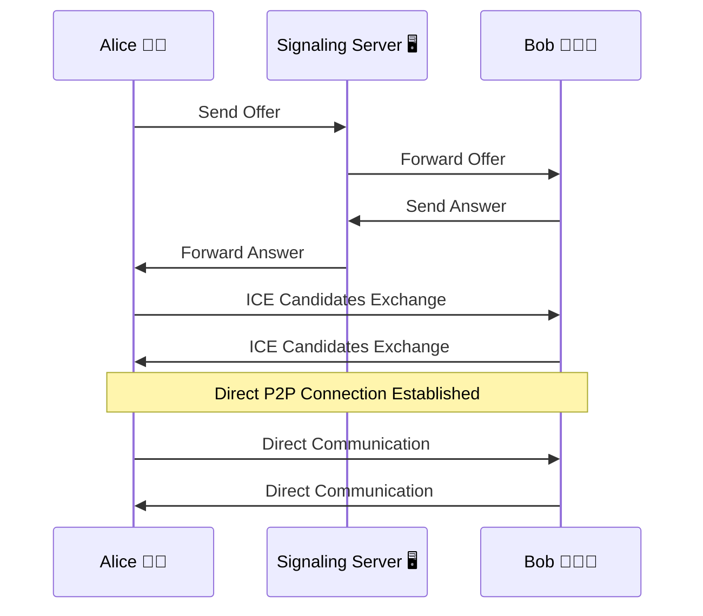

    --{{2}}--
The beauty of WebRTC is that once the connection is established, data flows directly between browsers without going through a central server.
This reduces latency and allows for more responsive interactions with remote lab equipment.

### CRDTs: Ensuring Data Consistency

    --{{0}}--
The second key technology in edrys-Lite is Conflict-Free Replicated Data Types, or CRDTs, implemented using the Yjs library.
CRDTs solve a critical problem in distributed systems: how to maintain consistent data across multiple users who may be making changes simultaneously.

What are CRDTs?
-------------------

* Data structures designed for concurrent editing
* Allow independent updates without coordination
* Automatically resolve conflicts
* Guarantee eventual consistency
* Enable offline-first applications

    --{{1}}--
In simpler terms, CRDTs allow multiple users to make changes to the same data simultaneously, even if they're temporarily disconnected, and the system will automatically reconcile these changes in a consistent way when connectivity is restored.

#### How CRDTs Work in edrys-Lite

    --{{0}}--
Let's explore how CRDTs enable collaborative editing and state synchronization in edrys-Lite modules.

CRDT Principles in Action
-------------------------

1. **Local Modifications**: Each user can modify their local copy of data
2. **Operation-Based Approach**: Changes are tracked as operations, not just end states
3. **Merge Operations**: When users reconnect, their operations are merged
4. **Conflict Resolution**: Built-in rules determine how to resolve conflicting changes
5. **Eventual Consistency**: All users eventually see the same state

    --{{1}}--
For example, if two students are editing the same code in an edrys-Lite module, their changes are tracked as operations (like "insert character X at position Y").
These operations can be merged in a way that preserves both students' intentions, even if they were working offline for a period.

      {{1}}
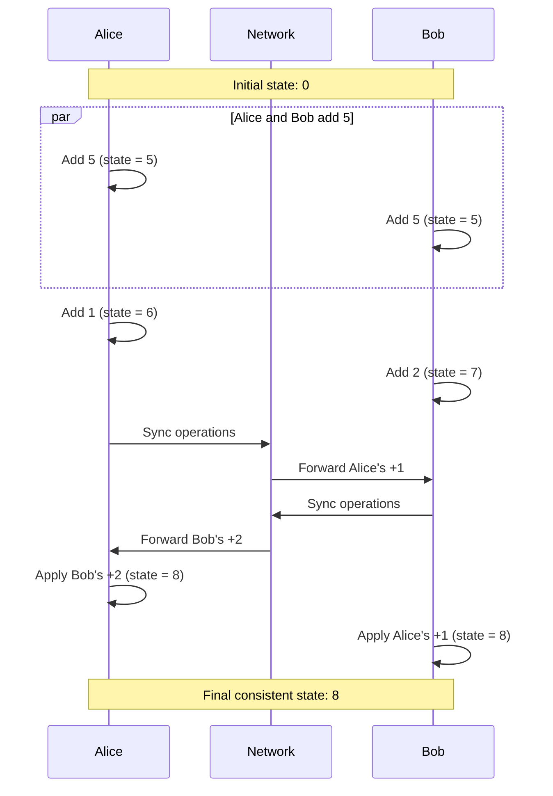

    --{{2}}--
In this example, both Alice and Bob start with a counter at 0.
They both add 5, then Alice adds 1 while Bob adds 2.
When their changes are synchronized, the CRDT ensures that both end up with the same final value of 8, correctly incorporating both of their changes.

### Why These Technologies Matter for Remote Labs

    --{{0}}--
The combination of WebRTC and CRDTs creates a powerful foundation for remote lab experiences in edrys-Lite.

Benefits for Remote Labs
------------------------

* **Low Latency**: Direct connections minimize delay when controlling equipment
* **Resilience**: Continue working even with temporary connection issues
* **Collaboration**: Multiple users can interact with the same lab simultaneously
* **Minimal Infrastructure**: No need for powerful central servers
* **Scalability**: Peer-to-peer architecture distributes the communication load

    --{{1}}--
These technologies enable edrys-Lite to provide a responsive, collaborative environment for remote labs that works across different network conditions and scales effectively to support multiple simultaneous users.

### Technical Architecture Overview

    --{{0}}--
Let's put it all together to understand how these technologies form the backbone of edrys-Lite.

edrys-Lite Architecture
-----------------------

* **Browser-Based**: Everything runs in standard web browsers
* **WebRTC**: Enables direct peer-to-peer connections
* **CRDTs (Yjs)**: Ensures data consistency across users
* **Modular Design**: Independent modules communicate via messages
* **Publish-Subscribe**: Modules exchange messages through a simple pub-sub system
* **Role-Based Access**: Different capabilities for teachers, students, and stations

      {{1}}
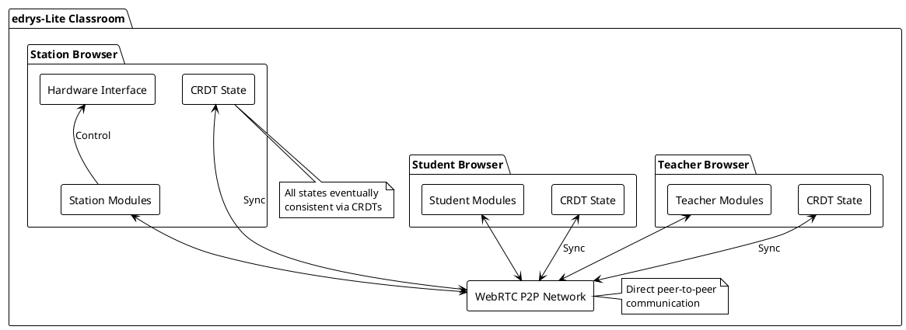

    --{{1}}--
This architecture allows edrys-Lite to provide a flexible, extensible platform for remote labs that can be adapted to a wide range of educational and experimental scenarios.

    --{{2}}--
Now that we understand the technologies behind edrys-Lite, we're ready to dive into the hands-on portion of the workshop.
In the next section, we'll go through the process of creating a lab, configuring modules, and connecting them to create an interactive remote lab experience.

## Hands-on Lab Creation with edrys-Lite

    --{{0}}--
Now that we understand the core concepts and technologies behind edrys-Lite, let's dive into the practical part of our workshop.
In this section, we'll go through the step-by-step process of creating a lab, configuring modules, and connecting them to create an interactive remote lab experience.

### Creating Your First edrys-Lite Classroom

    --{{0}}--
Let's start by creating our first edrys-Lite classroom.
This will be the environment where teachers and students can collaborate and interact with remote lab equipment.

Step 1: Access edrys-Lite
-------------------------

1. Open your web browser and navigate to [https://edrys-labs.github.io](https://edrys-labs.github.io)
2. You'll see a simple interface with a "Create a class" option
3. Click on this option to start creating your classroom

    --{{1}}--
When you first visit edrys-Lite, you'll notice its minimalist interface.
This is by design - edrys-Lite focuses on functionality rather than complex menus and options, making it accessible even to users with limited technical experience.

      {{1}}
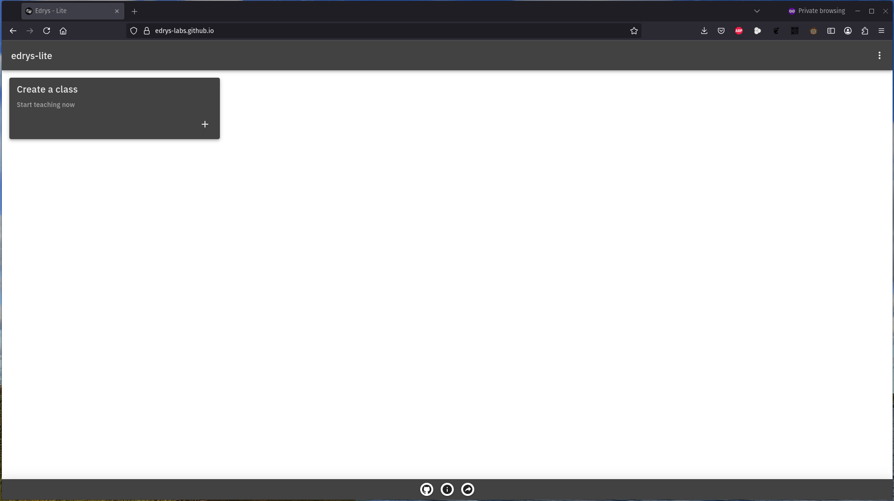

### Understanding Roles in edrys-Lite

    --{{0}}--
Before we proceed further, it's important to understand the three different roles in edrys-Lite: Teacher, Student, and Station.
Each role has specific permissions and capabilities within the system.

Three Key Roles
---------------

1. **Teacher**

   * Creates and configures classrooms
   * Adds and manages modules
   * Controls access permissions
   * Can modify all aspects of the lab

2. **Student**

   * Joins existing classrooms
   * Interacts with modules based on permissions
   * Collaborates with peers and teachers
   * Cannot modify classroom configuration

3. **Station**

   * Represents specialized hardware
   * Acts as a resource node in the classroom
   * Can be connected to physical equipment
   * Provides access to real-world devices

    --{{1}}--
When you create a classroom, you automatically become a teacher in that environment.
You can then invite others to join as teachers, students, or stations, depending on their role in the learning experience.

### Classroom Setup and Configuration

    --{{0}}--
After clicking "Create a class" a new classroom will be generated with a unique ID in the URL.
This URL is what you'll share with your students and colleagues to invite them to your classroom.

<section>

### Step 2: Configure Classroom Settings

1. Once your classroom is created, click on the "Settings" button

   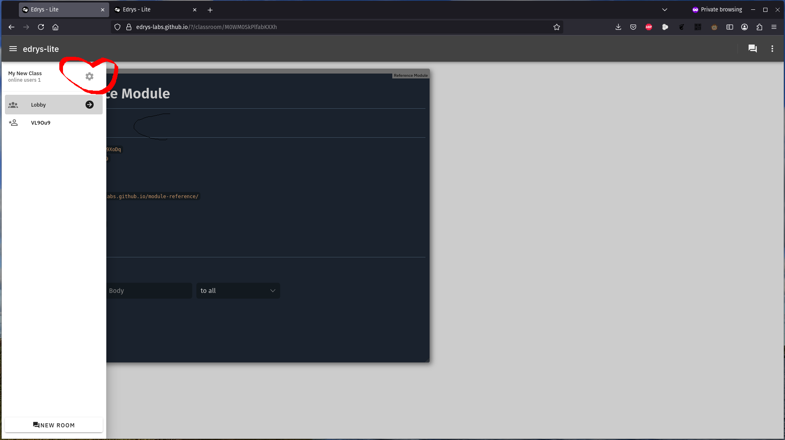

      {{2}}
2. You'll see options to:

   * Add a class name
   * Add a description
   * Set a logo URL
   * Configure the default number of rooms
   * Enable or disable self-assignment

</section>

    --{{2}}--
The classroom settings allow you to personalize your lab environment and control how users interact with it.
For example, enabling self-assignment allows students to choose which room they want to join, while disabling it gives teachers more control over student placement.

      {{2}}
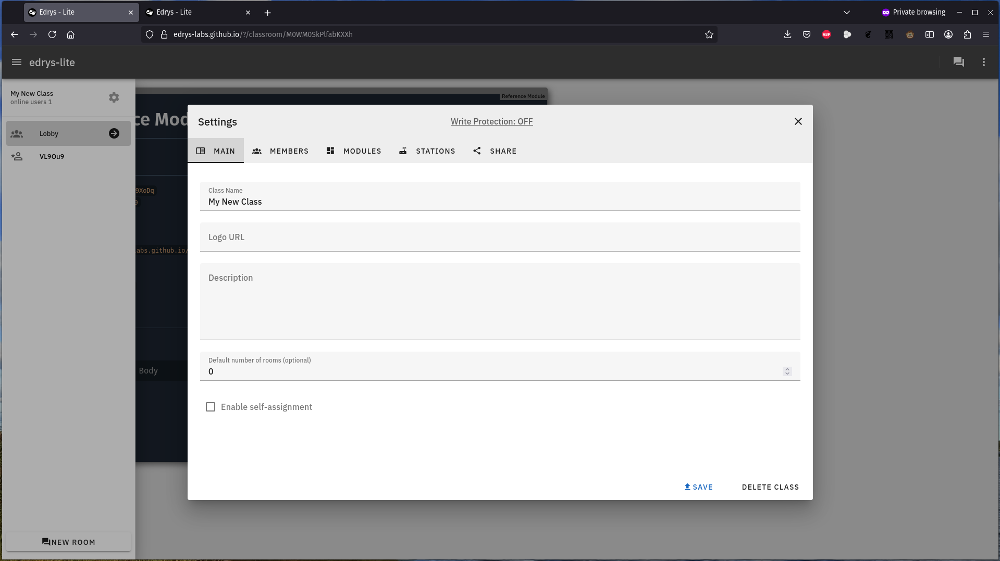

    --{{3}}--
After configuring these basic settings, you'll want to add members to your classroom.
This is done through the Members tab in the Settings panel.

      {{3}}
<section>

### Step 3: Add Members

1. In the Settings panel, click on the "Members" tab
2. You'll see options to add:

   * Teacher IDs - these users can modify the classroom
   * Student IDs - these users can interact with modules

3. User IDs are displayed in the top right corner of each user's browser
4. You can add multiple IDs separated by commas
5. Use an asterisk (*) to allow anyone to join as a student

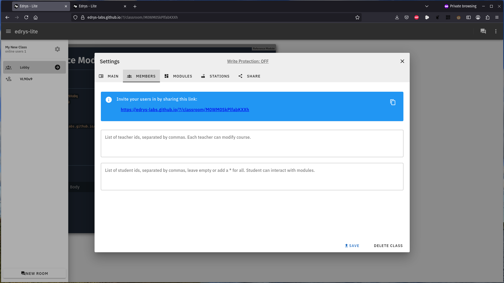

</section>

    --{{4}}--
By default, anyone with the classroom URL can join as a student.
By adding specific student IDs, you restrict access to only those users, giving you more control over who can participate in your lab.

### Adding and Configuring Modules

    --{{0}}--
Now that we have our classroom set up, let's add some modules to create our interactive lab environment.
Modules are the building blocks of edrys-Lite labs, each providing specific functionality.

Step 4: Add Modules
-------------------

1. In the Settings panel, click on the "Modules" tab
2. Click the "Add" button to open the Modules Explorer
3. Browse available modules or enter a module URL
4. Click the "+" button next to a module to add it to your classroom

    --{{1}}--
edrys-Lite comes with several built-in modules, but you can also add custom modules by providing their URL.
This extensibility is one of the key strengths of the platform.

      {{1}}
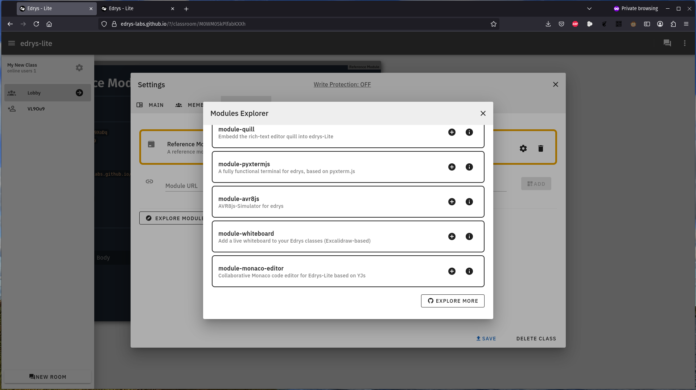

    --{{2}}--
Let's explore some of the most commonly used modules in edrys-Lite labs.

      {{2}}
<section>

### Common edrys-Lite Modules

1. **module-markdown-it**

   * Displays formatted text and instructions
   * Supports code blocks, images, and links
   * Essential for providing lab instructions

2. **module-editor**

   * Collaborative code editor
   * Syntax highlighting for various languages
   * Real-time synchronization between users

3. **module-streaming**

   * Shares camera feeds from stations
   * Allows students to see physical equipment
   * Essential for remote observation

4. **module-pytermjs**

   * Terminal emulator for command-line interaction
   * Connects to hardware via WebSerial
   * Used for programming and controlling devices

5. **module-quill**

   * Rich text editor for note-taking
   * Collaborative document editing
   * Useful for student reports and documentation

</section>

    --{{3}}--
For our first lab, let's add a markdown module for instructions and an editor module for code.
These two modules form the foundation of many educational labs.

### Module Configuration and Placement

    --{{0}}--
After adding modules, you'll need to configure them to suit your specific lab requirements.
Each module has its own configuration options.

Step 5: Configure Modules
-------------------------

1. For each added module, you'll see configuration options:

   * URL - the source of the module
   * Design - appearance settings like width and height
   * General Settings - module-specific options
   * Show in - which rooms the module appears in

2. Click on these options to customize each module
3. Use the "Save" button to apply your changes

    --{{1}}--
The "Show in" option is particularly important as it determines where your module will be visible.
You can specify individual rooms, use "lobby" for the main classroom area, or use an asterisk (*) to show the module everywhere.

      {{1}}
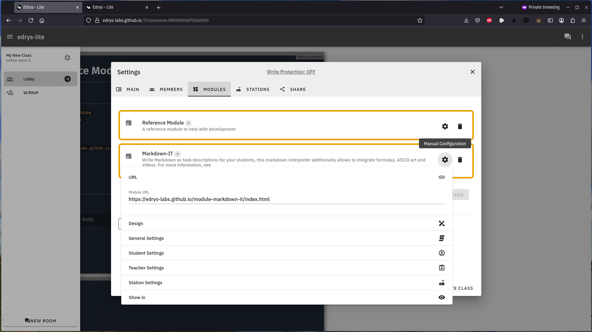

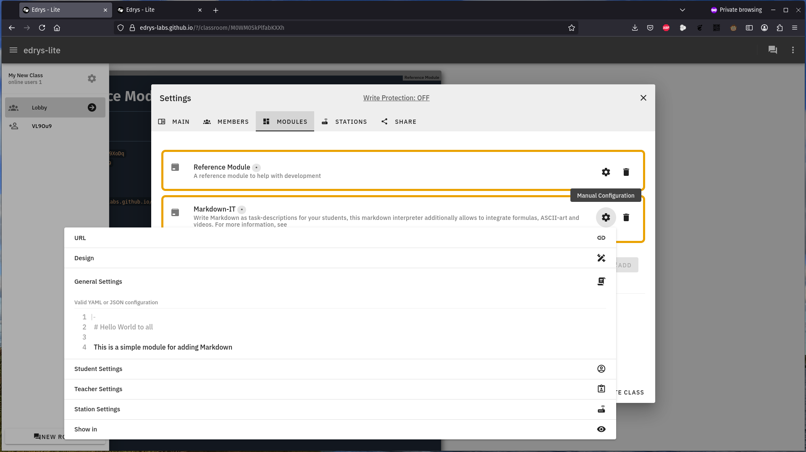
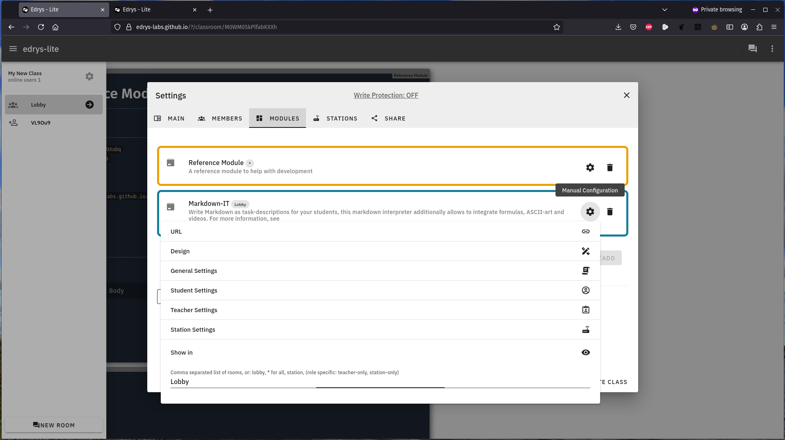
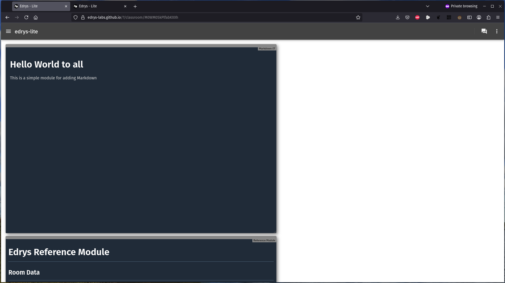

    --{{2}}--
You can also rearrange modules by dragging and dropping them in the modules list.
This affects their visual order in the classroom interface.

### Creating a Basic Lab Example

    --{{0}}--
Let's put everything together to create a simple programming lab.
We'll set up a lab where students can read instructions and write code to solve programming challenges.

Step 6: Create a Programming Lab
--------------------------------

1. Add a markdown-it module for instructions

   * Configure it to show in the lobby
   * Add instructions in markdown format
   * Add the "General Settings" to show the module in the lobby

   ``` yaml
   |-
     # Microbit V2 MicroPython Intro

     Welcome to the Microbit V2 MicroPython course. In this module, you will receive a general overview of the course content including:

     - **API Overview:** Understand how to interact with the board’s functionalities.
     - **Sensors:** Learn about accelerometers, temperature sensors, and more.
     - **Sound & Display:** Discover how to program the board to produce sound and display images.

     This course is designed to provide you with both theoretical insights and practical examples to get started with MicroPython on the Microbit V2.

     <iframe style="width: 100%; aspect-ratio: 16 / 9" src="https://www.youtube-nocookie.com/embed/PITLKocdY14?si=P6EQvXpsCICqCHo6" title="YouTube video player" frameborder="0" allow="accelerometer; autoplay; clipboard-write; encrypted-media; gyroscope; picture-in-picture; web-share" referrerpolicy="strict-origin-when-cross-origin" allowfullscreen></iframe>
   ```

2. Add another markdown-it module for instructions

   * Configure it to show in the station
   * Add instructions in markdown format
   * Add the "General Settings" to show the module in the station

   ```` yaml
   |-
     # MicroPython with Microbit V2: Hands-on Examples

     Welcome students! In this module, you'll explore practical examples that demonstrate how to interact with your Microbit V2 board using MicroPython.

     ## Example 1: Basic Arithmetic and Display

     ```python
     # Perform a simple arithmetic operation and display the result
     result = 12 + 2
     print("The result is:", result)
     ```

     ## Example 2: Display an Image

     ```python
     from microbit import 

     display.show(Image.HEART)
     ```

     ## Example 3: Using the Accelerometer Sensor

     ```python
     from microbit import *

     while True:
         # Get the X-axis reading from the accelerometer
         x_reading = accelerometer.get_x()

         print("X-axis:", x_reading)

         sleep(1000)
   ```

   Experiment with these examples to see how the Microbit V2 reacts to your code!
   ````

3. Add the module-station-stream webcam sharing

   * Configure it to show in station
   * Set the initial code template if needed

   ``` yaml
   video: true
   audio: false
   ```

4. Add a module-serial module for running a terminal

   * Configure it to show in station

    --{{1}}--
This basic setup creates a lab where students can read instructions, write code, and execute it to see the results.
It's a foundation that can be expanded with additional modules as needed.

### Module Interconnection

    --{{0}}--
One of the powerful features of edrys-Lite is the ability for modules to communicate with each other.
This allows you to create integrated lab experiences where actions in one module affect others.

Module Communication
--------------------

* Modules use a publish-subscribe (pub-sub) mechanism
* Messages are sent on specific topics
* Other modules can subscribe to these topics
* This enables coordinated behavior across modules

    --{{1}}--
For example, a button in a markdown module could publish a message that triggers the execution of code in the terminal module.
This interconnection allows for creative and interactive lab designs.

### Room Management

    --{{0}}--
edrys-Lite classrooms can be divided into multiple rooms, allowing you to organize students into groups or provide different lab experiences to different users.

Step 7: Manage Rooms
--------------------

1. In the main classroom view, you'll see a "Create new Room" button
2. Click this to add a new room to your classroom
3. Each room can have its own set of modules

    --{{1}}--
Rooms are a powerful way to organize larger classes or to provide different lab experiences to different groups of students.
For example, you might have different rooms for beginners and advanced students, each with appropriately configured modules.

### Testing Your Lab

    --{{0}}--
Before sharing your lab with students, it's important to test it to ensure everything works as expected.

Step 8: Test Your Lab
---------------------

1. Open your classroom URL in a different browser or incognito window
2. Join as a student to see the student perspective
3. Test all module interactions
4. Verify that permissions work correctly
5. Check that modules communicate as expected

    --{{1}}--
Testing from a student perspective helps you identify any issues or confusion points before your actual students encounter them.
It's an essential step in creating effective remote labs.

    --{{2}}--
Now that we've created and configured our basic lab, in the next section we'll explore how to save and share your labs, including storing them locally, on GitHub, and sharing them with other users.

``` yaml
|-
  # Publish Subscribe
  
  Events can be sent to other modules using the publish-subscribe mechanism.
  
  <button onclick="Edrys.sendMessage('w', 'print(12 + 2)\r\n')">Send</button>
  
  <button onclick="Edrys.sendMessage('w', 'display.show(Image.HEART)\r\n')">Heart</button>
```

### Connecting Hardware

    --{{0}}--
To connect the micro:bit to edrys-Lite, we'll use the WebSerial API, which allows web applications to communicate with serial devices directly from the browser.

Understanding WebSerial
-----------------------

* A modern web API for serial communication
* Allows browsers to connect to USB devices
* Requires user permission for security
* Supported in Chrome, Edge, and other Chromium-based browsers
* Enables bidirectional communication with hardware

    --{{1}}--
The WebSerial API is what makes it possible to program and communicate with the micro:bit directly from edrys-Lite without requiring any additional software installation, making the setup process much simpler for students.

      {{2}}
<section>

Connecting micro:bit to edrys-Lite
----------------------------------

    --{{2}}--
Now, let's walk through the process of connecting a micro:bit to edrys-Lite using the WebSerial API.

</section>

      {{3}}
<section>

Hardware Setup
--------------

1. Connect the micro:bit v2 to your computer using a USB cable
2. Ensure the micro:bit is recognized by your computer
3. No additional drivers should be needed for most operating systems

    --{{3}}--
The micro:bit will appear as a USB storage device when first connected.
We'll use the WebSerial API to communicate with the preinstalled MicroPython.

</section>

## Storing and Sharing Labs

    --{{0}}--
Now that we've created our edrys-Lite lab, let's explore how to save, store, and share it with others.
edrys-Lite provides several options for preserving your work and collaborating with colleagues.

### Local Storage Options

    --{{0}}--
By default, edrys-Lite stores your classroom configuration in your browser's local storage.
This makes it easy to return to your work, but it has some limitations.

Browser-Based Storage
---------------------

* **Automatic Saving**: Changes are automatically saved in your browser
* **Persistence**: Your lab remains available when you return to the URL
* **Device-Specific**: Labs are tied to the browser and device where they were created
* **Limited Space**: Browser storage has capacity limits
* **Vulnerability**: Clearing browser data will erase your labs

    --{{1}}--
While convenient, browser-based storage isn't ideal for long-term preservation or for sharing labs across devices.
Let's look at more robust options.

### Exporting and Importing Labs

    --{{0}}--
edrys-Lite allows you to export your lab configuration as a JSON file, which you can then import later or on a different device.

Step 1: Export Your Lab
-----------------------

1. In your classroom, click on the "Settings" button
2. Navigate to the "Share" tab
3. Click on "Export Configuration"
4. Save the YAML file to your local device

    --{{1}}--
This YAML file contains all the information about your classroom, including modules, settings, and configurations.
It's a complete snapshot of your lab at the time of export.

      {{2}}
<section>

Step 2: Import a Lab
--------------------

1. On the edrys-Lite homepage, create a new class
2. In the new classroom, click on "Settings"
3. Navigate to the "Share" tab
4. Click on "Import Configuration"
5. Select your previously saved JSON file

</section>

    --{{2}}--
Importing a configuration completely replaces the current classroom setup with the one from the file.
This makes it easy to recreate labs exactly as they were configured.

### GitHub Integration

    --{{0}}--
For more robust storage and version control, you can save your edrys-Lite labs to GitHub repositories.
This approach offers several advantages over local storage.

Benefits of GitHub Storage
--------------------------

* **Version Control**: Track changes to your lab over time
* **Collaboration**: Multiple teachers can contribute to the same lab
* **Backup**: Secure cloud-based storage
* **Sharing**: Easy to share with colleagues via GitHub
* **Documentation**: Use GitHub's features to document your lab

    --{{1}}--
Let's walk through the process of saving an edrys-Lite lab to GitHub.

      {{1}}
<section>

Step 3: Save to GitHub
----------------------

1. Create a GitHub account if you don't already have one
2. Create a new repository for your lab
3. In your edrys-Lite classroom, export the configuration as described earlier
4. In your GitHub repository:

   * Click "Add file" > "Create new file"
   * Name it "classroom.yaml"
   * Paste the contents of your exported configuration
   * Commit the changes

<section>

    --{{2}}--
You can also add additional files to your GitHub repository, such as documentation, images, or supplementary materials for your lab.

### Loading Labs from GitHub

    --{{0}}--
Once your lab is stored on GitHub, you can easily load it into edrys-Lite whenever needed.


Step 4: Load from GitHub
------------------------

1. In edrys-Lite, create a new classroom
2. Click on "Settings" and go to the "Share" tab
3. In the "Import from URL" field, enter the raw URL of your GitHub JSON file

   * Format: `https://raw.githubusercontent.com/username/repository/branch/classroom.json`

4. Click "Import"

    --{{1}}--
This will load the configuration from GitHub, replacing the current classroom setup.
It's a convenient way to quickly set up labs that you've previously created and stored.


## Microbit: Hardware Capabilities

* **5×5 LED Matrix**: Visual output and simple graphics
* **Two Programmable Buttons**: User input
* **Touch Logo**: Capacitive touch sensor
* **Microphone**: Sound detection
* **Speaker**: Audio output
* **Motion Sensors**: Accelerometer and magnetometer
* **Temperature Sensor**: Environmental monitoring
* **Light Sensor**: Using the LED matrix
* **Pins**: For connecting external components
* **Bluetooth**: Wireless communication
* **USB Connection**: Programming and power

### Example: Test Basic Commands

Try typing these commands in the terminal:

```python
from microbit import *

# Display a heart on the LED matrix
display.show(Image.HEART)

# Display a scrolling message
display.scroll("Hello edrys!")

# Read the temperature
temp = temperature()
print("Temperature:", temp)

# Detect button presses
while True:
    if button_a.is_pressed():
        display.show("A")
    elif button_b.is_pressed():
        display.show("B")
    else:
        display.clear()
```

### Example: Interactive Sensor Display

```python
from microbit import *
import music

# Function to map values to LED brightness levels
def map_value(value, in_min, in_max, out_min, out_max):
    return int((value - in_min) * (out_max - out_min) / (in_max - in_min) + out_min)

# Main loop
while True:
    # Check for button presses to change mode
    if button_a.was_pressed():
        display.scroll("Temp")
        mode = "temperature"
    elif button_b.was_pressed():
        display.scroll("Light")
        mode = "light"
    
    # Temperature mode
    if mode == "temperature":
        temp = temperature()
        # Map temperature (typically 15-30) to brightness (0-9)
        brightness = map_value(temp, 15, 30, 0, 9)
        # Create a custom image with the brightness level
        img = Image("00000:"
                   "00000:"
                   "00{0}00:"
                   "00000:"
                   "00000".format(brightness))
        display.show(img)
        # Print temperature to serial
        print("Temperature:", temp)
    
    # Light mode
    elif mode == "light":
        # Read light level using LED display as sensor
        light = display.read_light_level()
        # Map light level (0-255) to brightness (0-9)
        brightness = map_value(light, 0, 255, 0, 9)
        # Create a custom image with the brightness level
        img = Image("0{0}0{0}0:"
                   "{0}000{0}:"
                   "00000:"
                   "{0}000{0}:"
                   "0{0}0{0}0".format(brightness))
        display.show(img)
        # Print light level to serial
        print("Light level:", light)
    
    # Play tone if touch logo is pressed
    if pin_logo.is_touched():
        music.play(music.NYAN)
    
    # Short delay
    sleep(100)
```

### Example: Data Logger

```python
from microbit import *
import random

# Initialize variables
logging = False
data_points = []

# Main loop
while True:
    # Start/stop logging with button A
    if button_a.was_pressed():
        logging = not logging
        if logging:
            display.show(Image.YES)
            print("Logging started")
            data_points = []
        else:
            display.show(Image.NO)
            print("Logging stopped")
            # Print all collected data
            print("Collected data:")
            for i, point in enumerate(data_points):
                print(f"{i}: {point}")
    
    # Collect data point with button B
    if button_b.was_pressed() and logging:
        # Read temperature
        temp = temperature()
        # Read acceleration
        x, y, z = accelerometer.get_values()
        # Store data point
        data_point = {
            "temp": temp,
            "accel_x": x,
            "accel_y": y,
            "accel_z": z
        }
        data_points.append(data_point)
        display.show(len(data_points))
        print(f"Data point {len(data_points)} recorded: {data_point}")
    
    # Show logging status
    if logging:
        if random.randint(0, 5) == 0:  # Occasional animation
            display.show(Image.HEART)
            sleep(100)
            display.show(Image.HEART_SMALL)
            sleep(100)
    
    sleep(100)
```

### Example: Remote Control

```python
from microbit import *

# Define motor pins
left_forward = pin0
left_backward = pin1
right_forward = pin2
right_backward = pin8

# Set pins as outputs
left_forward.write_digital(0)
left_backward.write_digital(0)
right_forward.write_digital(0)
right_backward.write_digital(0)

# Function to control motors
def move(direction):
    if direction == "forward":
        left_forward.write_digital(1)
        left_backward.write_digital(0)
        right_forward.write_digital(1)
        right_backward.write_digital(0)
        display.show(Image.ARROW_N)
    elif direction == "backward":
        left_forward.write_digital(0)
        left_backward.write_digital(1)
        right_forward.write_digital(0)
        right_backward.write_digital(1)
        display.show(Image.ARROW_S)
    elif direction == "left":
        left_forward.write_digital(0)
        left_backward.write_digital(1)
        right_forward.write_digital(1)
        right_backward.write_digital(0)
        display.show(Image.ARROW_W)
    elif direction == "right":
        left_forward.write_digital(1)
        left_backward.write_digital(0)
        right_forward.write_digital(0)
        right_backward.write_digital(1)
        display.show(Image.ARROW_E)
    elif direction == "stop":
        left_forward.write_digital(0)
        left_backward.write_digital(0)
        right_forward.write_digital(0)
        right_backward.write_digital(0)
        display.show(Image.SQUARE_SMALL)

# Main loop - listen for commands
while True:
    # Check if data is available on serial
    if uart.any():
        # Read command
        command = uart.readline().decode('utf-8').strip()
        print("Received command:", command)
        
        # Execute command
        if command in ["forward", "backward", "left", "right", "stop"]:
            move(command)
        else:
            print("Unknown command")
    
    # Also check buttons for local control
    if button_a.is_pressed() and button_b.is_pressed():
        move("stop")
    elif button_a.is_pressed():
        move("left")
    elif button_b.is_pressed():
        move("right")
    
    sleep(100)
```
