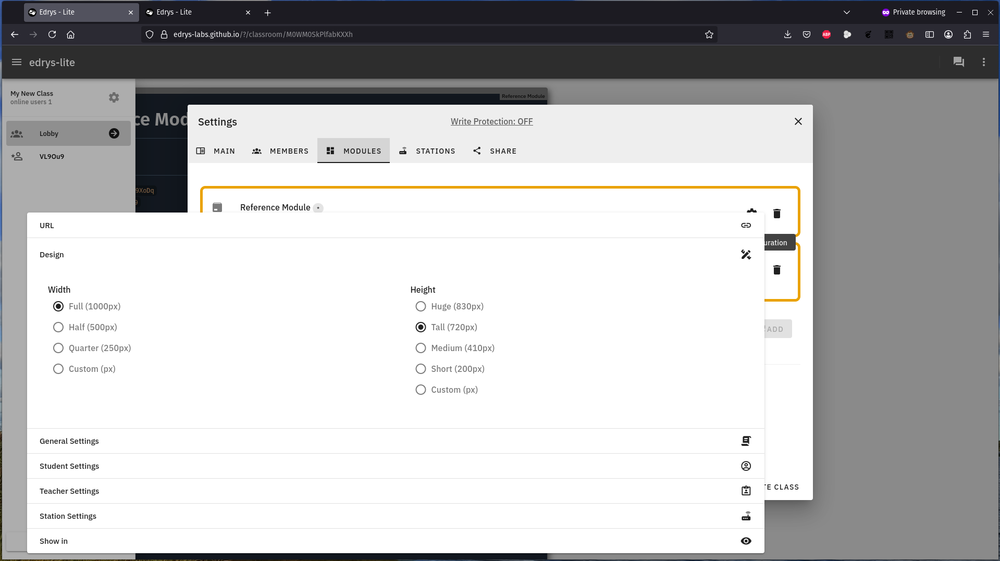
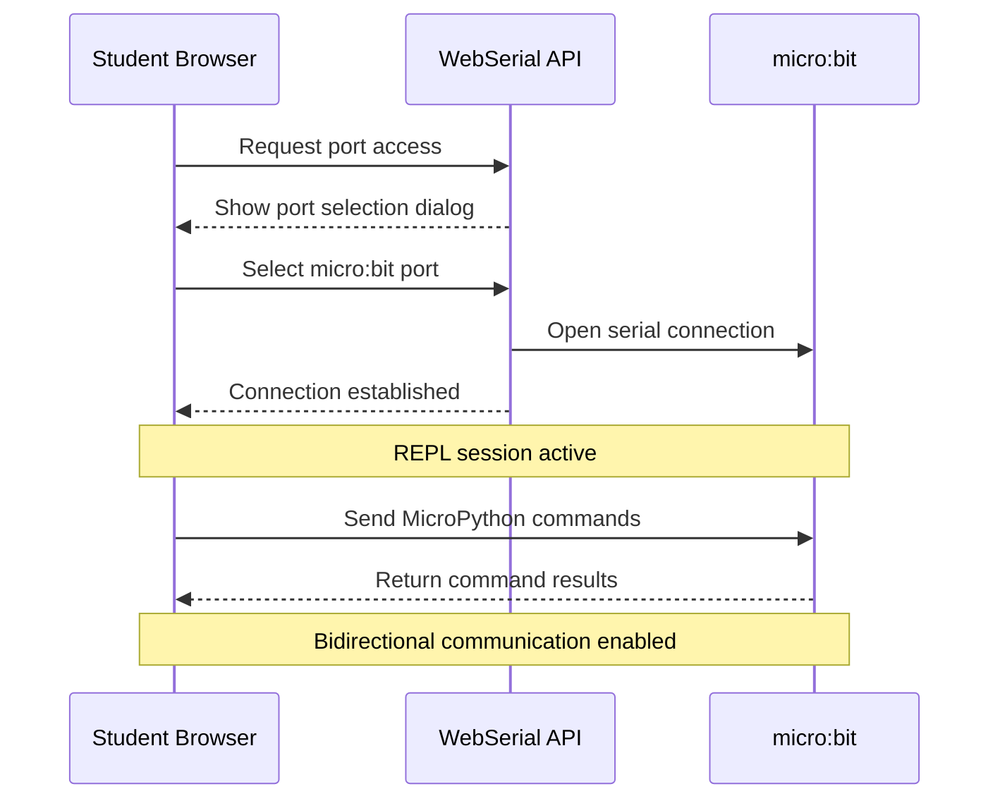

```mermaid  @mermaid
sequenceDiagram
    participant Alice as Alice 👩‍💻
    participant Server as Signaling Server 🖥️
    participant Bob as Bob 👨🏾‍💻
    
    Alice->>Server: Send Offer
    Server->>Bob: Forward Offer
    Bob->>Server: Send Answer
    Server->>Alice: Forward Answer
    
    Alice->>Bob: ICE Candidates Exchange
    Bob->>Alice: ICE Candidates Exchange
    
    Note over Alice,Bob: Direct P2P Connection Established
    
    Alice->>Bob: Direct Communication
    Bob->>Alice: Direct Communication
```

<!--
author:  André Dietrich; Sebastian Zug; Ines Aubel
email:   andre.dietrich@informatik.tu-freiberg.de
version: 1.0.0
language: en
narrator: UK English Female
comment:  A workshop about edrys-Lite, a web app for browser-based sharing of remote labs

import: https://raw.githubusercontent.com/LiaTemplates/mermaid_template/0.1.4/README.md
        https://raw.githubusercontent.com/liascript-templates/plantUML/master/README.md

-->

# edrys-Lite Workshop: Browser-Based Remote Labs

    --{{0}}--
Welcome to this comprehensive workshop on edrys-Lite!
Throughout this session, we'll explore how to create, configure, and extend browser-based remote labs using edrys-Lite.
By the end, you'll have the knowledge and skills to implement your own collaborative remote lab environments.

## Workshop Overview

    --{{0}}--
Before we dive into the details, let's take a look at what we'll cover in this workshop.

Workshop Sections
-----------------

1. **Introduction to edrys-Lite**

   * What is edrys-Lite?
   * Core concepts and ideas
   * Benefits and use cases
   * Technologies behind edrys-Lite

2. **Hands-on Lab Creation**

   * Creating your first edrys-Lite classroom
   * Adding and configuring modules
   * Room management

4. **Storing and Sharing Labs**

   * Local storage options
   * GitHub integration
   * Sharing with other users

5. **Micro:bit Integration**

   * Connecting micro:bit via WebSerial
   * MicroPython programming
   * Example projects

6. **Creating Custom Modules**

   * Module architecture
   * Edrys API fundamentals
   * Building collaborative interfaces

    --{{1}}--
This workshop is designed to be hands-on, so I encourage you to follow along with the examples and try things out as we go.
Let's get started with an introduction to edrys-Lite!

## Introduction to edrys-Lite

    --{{0}}--
Welcome to this workshop on edrys-Lite!
In this session, we'll explore how edrys-Lite enables browser-based sharing of remote labs, making collaborative learning and experimentation more accessible than ever before.

### What is edrys-Lite?

    --{{0}}--
edrys-Lite is a lightweight, browser-based implementation designed for remote labs and classrooms.
It enables seamless collaboration by allowing users to create and interact with various modules such as textual and graphical editors, terminals, camera streams, and drawing tools.

edrys-Lite is a web application that:

* Runs entirely in your browser - no server installation required
* Enables real-time collaboration between teachers and students
* Provides access to remote laboratory equipment
* Supports a modular architecture for customization
* Uses modern web technologies for peer-to-peer communication

    --{{1}}--
The name "edrys" reflects its educational focus, while "Lite" indicates its lightweight nature, running directly in your browser without complex server setups.
This makes it incredibly accessible for educators and students alike.

### Core Concepts and Ideas

    --{{0}}--
Let's explore the core concepts that make edrys-Lite powerful and flexible for remote lab scenarios.

Key Concepts
------------

1. **Browser-Based Architecture**

   * Everything runs in standard web browsers
   * No plugins or special software needed
   * Works across devices and operating systems

2. **Modular Design**

   * Each component is an independent module
   * Modules can be combined and configured as needed
   * Easy to extend with custom functionality

3. **Role-Based Access**

   * Teacher role for creating and managing labs
   * Student role for participating in labs
   * Station role for specialized hardware connections

    --{{1}}--
The modular architecture is particularly important as it ensures that each module operates as an independent entity, making it configurable and reusable across different educational and experimental contexts.

### Benefits of edrys-Lite

    --{{0}}--
Why should educators and students be excited about edrys-Lite?
Let's look at some of the key benefits it offers for remote laboratory experiences.

Advantages for Education
------------------------

* **Accessibility**: Students can access lab equipment from anywhere with an internet connection
* **Collaboration**: Real-time interaction between teachers and students
* **Flexibility**: Labs can be configured for various subjects and learning objectives
* **Cost-Effective**: Share expensive equipment among many users
* **Scalability**: Support multiple students accessing the same resources
* **Inclusivity**: Enable participation for remote or mobility-restricted students

    --{{1}}--
One of the most significant benefits is how edrys-Lite democratizes access to laboratory equipment.
Expensive or specialized equipment that might only be available in certain locations can now be shared with students anywhere in the world.

### Use Cases

    --{{0}}--
edrys-Lite can be applied in various educational and research contexts.
Let's explore some practical use cases.

Example Applications
--------------------

* **Physics Labs**: Remote control of measurement equipment
* **Electronics**: Circuit design and testing with real components
* **Robotics**: Programming and controlling physical robots
* **Computer Science**: Collaborative coding environments
* **Biology**: Remote microscope control and observation
* **Engineering**: Testing and data collection from physical systems

    --{{1}}--
For instance, in an electronics lab, students could remotely program microcontrollers like the micro:bit, observe the results through a camera module, and collaborate with peers on debugging and improving their code—all from their own devices, regardless of location.

### Getting Started

    --{{0}}--
Before we dive into the technical details and hands-on activities, let's see how easy it is to access edrys-Lite.

To start using edrys-Lite:

1. Visit [https://edrys-labs.github.io](https://edrys-labs.github.io)
2. No account creation or login required
3. Create a class or join an existing one
4. Begin configuring your remote lab environment

    --{{1}}--
In the next section, we'll explore the technologies that power edrys-Lite, focusing on WebRTC for browser-to-browser communication and CRDTs for data synchronization.
Understanding these technologies will help you appreciate how edrys-Lite enables seamless collaboration in remote lab settings.

## Technologies Behind edrys-Lite

    --{{0}}--
In this section, we'll explore the key technologies that power edrys-Lite: WebRTC for browser-to-browser communication and CRDTs (Conflict-Free Replicated Data Types) based on Yjs for data synchronization.
Understanding these technologies will help you appreciate how edrys-Lite enables seamless collaboration in remote lab settings.

### WebRTC: Browser-to-Browser Communication

    --{{0}}--
WebRTC, which stands for Web Real-Time Communication, is a free and open-source project that provides web browsers and mobile applications with real-time communication capabilities via simple application programming interfaces.

What is WebRTC?
---------------

* An open standard for real-time communication
* Enables direct peer-to-peer connections between browsers
* Supports audio, video, and data transfer
* No plugins or additional software required
* Built into modern web browsers

    --{{1}}--
WebRTC is what allows edrys-Lite to establish direct connections between users' browsers, enabling them to share data, control remote equipment, and collaborate in real-time without requiring a central server to relay all the information.

#### How WebRTC Works

    --{{0}}--
Let's explore how WebRTC enables the peer-to-peer connections that make edrys-Lite possible.
The process involves several steps to establish a secure, direct connection between browsers.

WebRTC Connection Process
-------------------------

1. **Signaling**: Initial exchange of connection information
2. **ICE Candidates**: Finding possible network paths
3. **SDP Exchange**: Negotiating media capabilities
4. **Direct Connection**: Establishing peer-to-peer communication
5. **TURN Fallback**: Using relay servers if direct connection fails

    --{{1}}--
When you join an edrys-Lite classroom, your browser initiates this WebRTC connection process with other participants.
This enables the real-time sharing of lab modules, collaborative editing, and remote control of equipment.

      {{1}}


    --{{2}}--
The beauty of WebRTC is that once the connection is established, data flows directly between browsers without going through a central server.
This reduces latency and allows for more responsive interactions with remote lab equipment.

### CRDTs: Ensuring Data Consistency

    --{{0}}--
The second key technology in edrys-Lite is Conflict-Free Replicated Data Types, or CRDTs, implemented using the Yjs library.
CRDTs solve a critical problem in distributed systems: how to maintain consistent data across multiple users who may be making changes simultaneously.

What are CRDTs?
-------------------

* Data structures designed for concurrent editing
* Allow independent updates without coordination
* Automatically resolve conflicts
* Guarantee eventual consistency
* Enable offline-first applications

    --{{1}}--
In simpler terms, CRDTs allow multiple users to make changes to the same data simultaneously, even if they're temporarily disconnected, and the system will automatically reconcile these changes in a consistent way when connectivity is restored.

#### How CRDTs Work in edrys-Lite

    --{{0}}--
Let's explore how CRDTs enable collaborative editing and state synchronization in edrys-Lite modules.

CRDT Principles in Action
-------------------------

1. **Local Modifications**: Each user can modify their local copy of data
2. **Operation-Based Approach**: Changes are tracked as operations, not just end states
3. **Merge Operations**: When users reconnect, their operations are merged
4. **Conflict Resolution**: Built-in rules determine how to resolve conflicting changes
5. **Eventual Consistency**: All users eventually see the same state

    --{{1}}--
For example, if two students are editing the same code in an edrys-Lite module, their changes are tracked as operations (like "insert character X at position Y").
These operations can be merged in a way that preserves both students' intentions, even if they were working offline for a period.

      {{1}}


    --{{2}}--
In this example, both Alice and Bob start with a counter at 0.
They both add 5, then Alice adds 1 while Bob adds 2.
When their changes are synchronized, the CRDT ensures that both end up with the same final value of 8, correctly incorporating both of their changes.

### Why These Technologies Matter for Remote Labs

    --{{0}}--
The combination of WebRTC and CRDTs creates a powerful foundation for remote lab experiences in edrys-Lite.

Benefits for Remote Labs
------------------------

* **Low Latency**: Direct connections minimize delay when controlling equipment
* **Resilience**: Continue working even with temporary connection issues
* **Collaboration**: Multiple users can interact with the same lab simultaneously
* **Minimal Infrastructure**: No need for powerful central servers
* **Scalability**: Peer-to-peer architecture distributes the communication load

    --{{1}}--
These technologies enable edrys-Lite to provide a responsive, collaborative environment for remote labs that works across different network conditions and scales effectively to support multiple simultaneous users.

### Technical Architecture Overview

    --{{0}}--
Let's put it all together to understand how these technologies form the backbone of edrys-Lite.

edrys-Lite Architecture
-----------------------

* **Browser-Based**: Everything runs in standard web browsers
* **WebRTC**: Enables direct peer-to-peer connections
* **CRDTs (Yjs)**: Ensures data consistency across users
* **Modular Design**: Independent modules communicate via messages
* **Publish-Subscribe**: Modules exchange messages through a simple pub-sub system
* **Role-Based Access**: Different capabilities for teachers, students, and stations

      {{1}}


    --{{1}}--
This architecture allows edrys-Lite to provide a flexible, extensible platform for remote labs that can be adapted to a wide range of educational and experimental scenarios.

    --{{2}}--
Now that we understand the technologies behind edrys-Lite, we're ready to dive into the hands-on portion of the workshop.
In the next section, we'll go through the process of creating a lab, configuring modules, and connecting them to create an interactive remote lab experience.

## Hands-on Lab Creation with edrys-Lite

    --{{0}}--
Now that we understand the core concepts and technologies behind edrys-Lite, let's dive into the practical part of our workshop.
In this section, we'll go through the step-by-step process of creating a lab, configuring modules, and connecting them to create an interactive remote lab experience.

### Creating Your First edrys-Lite Classroom

    --{{0}}--
Let's start by creating our first edrys-Lite classroom.
This will be the environment where teachers and students can collaborate and interact with remote lab equipment.

Step 1: Access edrys-Lite
-------------------------

1. Open your web browser and navigate to [https://edrys-labs.github.io](https://edrys-labs.github.io)
2. You'll see a simple interface with a "Create a class" option
3. Click on this option to start creating your classroom

    --{{1}}--
When you first visit edrys-Lite, you'll notice its minimalist interface.
This is by design - edrys-Lite focuses on functionality rather than complex menus and options, making it accessible even to users with limited technical experience.

      {{1}}


### Understanding Roles in edrys-Lite

    --{{0}}--
Before we proceed further, it's important to understand the three different roles in edrys-Lite: Teacher, Student, and Station.
Each role has specific permissions and capabilities within the system.

Three Key Roles
---------------

1. **Teacher**

   * Creates and configures classrooms
   * Adds and manages modules
   * Controls access permissions
   * Can modify all aspects of the lab

2. **Student**

   * Joins existing classrooms
   * Interacts with modules based on permissions
   * Collaborates with peers and teachers
   * Cannot modify classroom configuration

3. **Station**

   * Represents specialized hardware
   * Acts as a resource node in the classroom
   * Can be connected to physical equipment
   * Provides access to real-world devices

    --{{1}}--
When you create a classroom, you automatically become a teacher in that environment.
You can then invite others to join as teachers, students, or stations, depending on their role in the learning experience.

### Classroom Setup and Configuration

    --{{0}}--
After clicking "Create a class" a new classroom will be generated with a unique ID in the URL.
This URL is what you'll share with your students and colleagues to invite them to your classroom.

<section>

### Step 2: Configure Classroom Settings

1. Once your classroom is created, click on the "Settings" button

   

      {{2}}
2. You'll see options to:

   * Add a class name
   * Add a description
   * Set a logo URL
   * Configure the default number of rooms
   * Enable or disable self-assignment

</section>

    --{{2}}--
The classroom settings allow you to personalize your lab environment and control how users interact with it.
For example, enabling self-assignment allows students to choose which room they want to join, while disabling it gives teachers more control over student placement.

      {{2}}


    --{{3}}--
After configuring these basic settings, you'll want to add members to your classroom.
This is done through the Members tab in the Settings panel.

      {{3}}
<section>

### Step 3: Add Members

1. In the Settings panel, click on the "Members" tab
2. You'll see options to add:

   * Teacher IDs - these users can modify the classroom
   * Student IDs - these users can interact with modules

3. User IDs are displayed in the top right corner of each user's browser
4. You can add multiple IDs separated by commas
5. Use an asterisk (*) to allow anyone to join as a student


</section>

    --{{4}}--
By default, anyone with the classroom URL can join as a student.
By adding specific student IDs, you restrict access to only those users, giving you more control over who can participate in your lab.

### Adding and Configuring Modules

    --{{0}}--
Now that we have our classroom set up, let's add some modules to create our interactive lab environment.
Modules are the building blocks of edrys-Lite labs, each providing specific functionality.

Step 4: Add Modules
-------------------

1. In the Settings panel, click on the "Modules" tab
2. Click the "Add" button to open the Modules Explorer
3. Browse available modules or enter a module URL
4. Click the "+" button next to a module to add it to your classroom

    --{{1}}--
edrys-Lite comes with several built-in modules, but you can also add custom modules by providing their URL.
This extensibility is one of the key strengths of the platform.

      {{1}}


    --{{2}}--
Let's explore some of the most commonly used modules in edrys-Lite labs.

      {{2}}
<section>

### Common edrys-Lite Modules

1. **module-markdown-it**

   * Displays formatted text and instructions
   * Supports code blocks, images, and links
   * Essential for providing lab instructions

2. **module-editor**

   * Collaborative code editor
   * Syntax highlighting for various languages
   * Real-time synchronization between users

3. **module-streaming**

   * Shares camera feeds from stations
   * Allows students to see physical equipment
   * Essential for remote observation

4. **module-pytermjs**

   * Terminal emulator for command-line interaction
   * Connects to hardware via WebSerial
   * Used for programming and controlling devices

5. **module-quill**

   * Rich text editor for note-taking
   * Collaborative document editing
   * Useful for student reports and documentation

</section>

    --{{3}}--
For our first lab, let's add a markdown module for instructions and an editor module for code.
These two modules form the foundation of many educational labs.

### Module Configuration and Placement

    --{{0}}--
After adding modules, you'll need to configure them to suit your specific lab requirements.
Each module has its own configuration options.

Step 5: Configure Modules
-------------------------

1. For each added module, you'll see configuration options:

   * URL - the source of the module
   * Design - appearance settings like width and height
   * General Settings - module-specific options
   * Show in - which rooms the module appears in

2. Click on these options to customize each module
3. Use the "Save" button to apply your changes

    --{{1}}--
The "Show in" option is particularly important as it determines where your module will be visible.
You can specify individual rooms, use "lobby" for the main classroom area, or use an asterisk (*) to show the module everywhere.

      {{1}}




    --{{2}}--
You can also rearrange modules by dragging and dropping them in the modules list.
This affects their visual order in the classroom interface.

### Creating a Basic Lab Example

    --{{0}}--
Let's put everything together to create a simple programming lab.
We'll set up a lab where students can read instructions and write code to solve programming challenges.

Step 6: Create a Programming Lab
--------------------------------

1. Add a markdown-it module for instructions

   * Configure it to show in the lobby
   * Add instructions in markdown format
   * Add the "General Settings" to show the module in the lobby

   ``` yaml
   |-
     # Microbit V2 MicroPython Intro

     Welcome to the Microbit V2 MicroPython course. In this module, you will receive a general overview of the course content including:

     - **API Overview:** Understand how to interact with the board’s functionalities.
     - **Sensors:** Learn about accelerometers, temperature sensors, and more.
     - **Sound & Display:** Discover how to program the board to produce sound and display images.

     This course is designed to provide you with both theoretical insights and practical examples to get started with MicroPython on the Microbit V2.

     <iframe style="width: 100%; aspect-ratio: 16 / 9" src="https://www.youtube-nocookie.com/embed/PITLKocdY14?si=P6EQvXpsCICqCHo6" title="YouTube video player" frameborder="0" allow="accelerometer; autoplay; clipboard-write; encrypted-media; gyroscope; picture-in-picture; web-share" referrerpolicy="strict-origin-when-cross-origin" allowfullscreen></iframe>
   ```

2. Add another markdown-it module for instructions

   * Configure it to show in the station
   * Add instructions in markdown format
   * Add the "General Settings" to show the module in the station

   ```` yaml
   |-
     # MicroPython with Microbit V2: Hands-on Examples

     Welcome students! In this module, you'll explore practical examples that demonstrate how to interact with your Microbit V2 board using MicroPython.

     ## Example 1: Basic Arithmetic and Display

     ```python
     # Perform a simple arithmetic operation and display the result
     result = 12 + 2
     print("The result is:", result)
     ```

     ## Example 2: Display an Image

     ```python
     from microbit import 

     display.show(Image.HEART)
     ```

     ## Example 3: Using the Accelerometer Sensor

     ```python
     from microbit import *

     while True:
         # Get the X-axis reading from the accelerometer
         x_reading = accelerometer.get_x()

         print("X-axis:", x_reading)

         sleep(1000)
   ```

   Experiment with these examples to see how the Microbit V2 reacts to your code!
   ````

3. Add the module-station-stream webcam sharing

   * Configure it to show in station
   * Set the initial code template if needed

   ``` yaml
   video: true
   audio: false
   ```

4. Add a module-serial module for running a terminal

   * Configure it to show in station

    --{{1}}--
This basic setup creates a lab where students can read instructions, write code, and execute it to see the results.
It's a foundation that can be expanded with additional modules as needed.

### Module Interconnection

    --{{0}}--
One of the powerful features of edrys-Lite is the ability for modules to communicate with each other.
This allows you to create integrated lab experiences where actions in one module affect others.

Module Communication
--------------------

* Modules use a publish-subscribe (pub-sub) mechanism
* Messages are sent on specific topics
* Other modules can subscribe to these topics
* This enables coordinated behavior across modules

    --{{1}}--
For example, a button in a markdown module could publish a message that triggers the execution of code in the terminal module.
This interconnection allows for creative and interactive lab designs.

### Room Management

    --{{0}}--
edrys-Lite classrooms can be divided into multiple rooms, allowing you to organize students into groups or provide different lab experiences to different users.

Step 7: Manage Rooms
--------------------

1. In the main classroom view, you'll see a "Create new Room" button
2. Click this to add a new room to your classroom
3. Each room can have its own set of modules

    --{{1}}--
Rooms are a powerful way to organize larger classes or to provide different lab experiences to different groups of students.
For example, you might have different rooms for beginners and advanced students, each with appropriately configured modules.

### Testing Your Lab

    --{{0}}--
Before sharing your lab with students, it's important to test it to ensure everything works as expected.

Step 8: Test Your Lab
---------------------

1. Open your classroom URL in a different browser or incognito window
2. Join as a student to see the student perspective
3. Test all module interactions
4. Verify that permissions work correctly
5. Check that modules communicate as expected

    --{{1}}--
Testing from a student perspective helps you identify any issues or confusion points before your actual students encounter them.
It's an essential step in creating effective remote labs.

    --{{2}}--
Now that we've created and configured our basic lab, in the next section we'll explore how to save and share your labs, including storing them locally, on GitHub, and sharing them with other users.

``` yaml
|-
  # Publish Subscribe
  
  Events can be sent to other modules using the publish-subscribe mechanism.
  
  <button onclick="Edrys.sendMessage('w', 'print(12 + 2)\r\n')">Send</button>
  
  <button onclick="Edrys.sendMessage('w', 'display.show(Image.HEART)\r\n')">Heart</button>
```

### WebSerial API Overview

    --{{0}}--
To connect the micro:bit to edrys-Lite, we'll use the WebSerial API, which allows web applications to communicate with serial devices directly from the browser.

Understanding WebSerial
-----------------------

* A modern web API for serial communication
* Allows browsers to connect to USB devices
* Requires user permission for security
* Supported in Chrome, Edge, and other Chromium-based browsers
* Enables bidirectional communication with hardware

    --{{1}}--
The WebSerial API is what makes it possible to program and communicate with the micro:bit directly from edrys-Lite without requiring any additional software installation, making the setup process much simpler for students.

### Connecting micro:bit to edrys-Lite

    --{{83}}--
Now, let's walk through the process of connecting a micro:bit to edrys-Lite using the WebSerial API.

      {{83}}
### Step 1: Hardware Setup

1. Connect the micro:bit v2 to your computer using a USB cable
2. Ensure the micro:bit is recognized by your computer
3. No additional drivers should be needed for most operating systems

    --{{84}}--
The micro:bit will appear as a USB storage device when first connected.
We'll use the WebSerial API to communicate with the preinstalled MicroPython.


## Storing and Sharing Labs

    --{{0}}--
Now that we've created our edrys-Lite lab, let's explore how to save, store, and share it with others.
edrys-Lite provides several options for preserving your work and collaborating with colleagues.

### Local Storage Options

    --{{0}}--
By default, edrys-Lite stores your classroom configuration in your browser's local storage.
This makes it easy to return to your work, but it has some limitations.

Browser-Based Storage
---------------------

* **Automatic Saving**: Changes are automatically saved in your browser
* **Persistence**: Your lab remains available when you return to the URL
* **Device-Specific**: Labs are tied to the browser and device where they were created
* **Limited Space**: Browser storage has capacity limits
* **Vulnerability**: Clearing browser data will erase your labs

    --{{1}}--
While convenient, browser-based storage isn't ideal for long-term preservation or for sharing labs across devices.
Let's look at more robust options.

### Exporting and Importing Labs

    --{{0}}--
edrys-Lite allows you to export your lab configuration as a JSON file, which you can then import later or on a different device.

Step 1: Export Your Lab
-----------------------

1. In your classroom, click on the "Settings" button
2. Navigate to the "Share" tab
3. Click on "Export Configuration"
4. Save the YAML file to your local device

    --{{1}}--
This YAML file contains all the information about your classroom, including modules, settings, and configurations.
It's a complete snapshot of your lab at the time of export.

      {{2}}
<section>

Step 2: Import a Lab
--------------------

1. On the edrys-Lite homepage, create a new class
2. In the new classroom, click on "Settings"
3. Navigate to the "Share" tab
4. Click on "Import Configuration"
5. Select your previously saved JSON file

</section>

    --{{2}}--
Importing a configuration completely replaces the current classroom setup with the one from the file.
This makes it easy to recreate labs exactly as they were configured.

### GitHub Integration

    --{{0}}--
For more robust storage and version control, you can save your edrys-Lite labs to GitHub repositories.
This approach offers several advantages over local storage.

Benefits of GitHub Storage
--------------------------

* **Version Control**: Track changes to your lab over time
* **Collaboration**: Multiple teachers can contribute to the same lab
* **Backup**: Secure cloud-based storage
* **Sharing**: Easy to share with colleagues via GitHub
* **Documentation**: Use GitHub's features to document your lab

    --{{1}}--
Let's walk through the process of saving an edrys-Lite lab to GitHub.

      {{1}}
<section>

Step 3: Save to GitHub
----------------------

1. Create a GitHub account if you don't already have one
2. Create a new repository for your lab
3. In your edrys-Lite classroom, export the configuration as described earlier
4. In your GitHub repository:

   * Click "Add file" > "Create new file"
   * Name it "classroom.yaml"
   * Paste the contents of your exported configuration
   * Commit the changes

<section>

    --{{2}}--
You can also add additional files to your GitHub repository, such as documentation, images, or supplementary materials for your lab.

### Loading Labs from GitHub

    --{{0}}--
Once your lab is stored on GitHub, you can easily load it into edrys-Lite whenever needed.


Step 4: Load from GitHub
------------------------

1. In edrys-Lite, create a new classroom
2. Click on "Settings" and go to the "Share" tab
3. In the "Import from URL" field, enter the raw URL of your GitHub JSON file

   * Format: `https://raw.githubusercontent.com/username/repository/branch/classroom.json`

4. Click "Import"

    --{{1}}--
This will load the configuration from GitHub, replacing the current classroom setup.
It's a convenient way to quickly set up labs that you've previously created and stored.

## Sharing Labs with Other Users

    --{{0}}--
One of the key benefits of edrys-Lite is how easily you can share your labs with students and colleagues.
Let's explore the different sharing options.

Sharing Options
---------------

1. **Direct URL Sharing**

   * Share the classroom URL with students
   * They can join immediately if no restrictions are set

2. **Restricted Access**

   * Add specific student IDs to the Members list
   * Only listed students can participate

3. **GitHub Sharing**

   * Share your GitHub repository with colleagues
   * They can import your lab into their own edrys-Lite instance

4. **Configuration File Sharing**

   * Share the exported YAML file directly
   * Recipients can import it into their edrys-Lite instance

    --{{2}}--
The simplest sharing method is direct URL sharing, where you simply send the classroom URL to your students.
However, for more control over who can access your lab, you may want to use the restricted access option.

## Managing Access to Shared Labs

    --{{0}}--
When sharing your labs, it's important to consider access control to ensure that only authorized users can participate and that they have the appropriate permissions.

Access Control Options
----------------------

1. **Open Access**

   * Anyone with the URL can join
   * Use for public workshops or demonstrations

2. **Student ID Restriction**

   * Only listed student IDs can join
   * Use for formal classes with known participants

3. **Teacher ID Addition**

   * Add colleague IDs as teachers
   * They gain full editing rights to the classroom

4. **Role-Based Permissions**

   * Teachers: Full control
   * Students: Interaction only
   * Stations: Hardware connection only

    --{{1}}--
By carefully managing access, you can create secure and controlled lab environments that meet your specific educational needs.

### Best Practices for Lab Management

    --{{0}}--
Based on experience with edrys-Lite, here are some recommended practices for managing your labs effectively.

Recommended Practices
---------------------

* **Version Your Labs**: Use semantic versioning (e.g., v1.0.0) in your GitHub commits
* **Document Changes**: Write clear commit messages describing what you modified
* **Test Before Sharing**: Always test your lab from a student perspective before sharing
* **Backup Regularly**: Export configurations regularly as a backup
* **Use Descriptive Names**: Give your labs clear, descriptive names in GitHub
* **Include README Files**: Add documentation to help others understand your lab

    --{{1}}--
Following these practices will help you maintain organized, reliable labs that can be easily shared and reused.

## Micro:bit Integration Preview

    --{{74}}--
In the next section, we'll explore how to integrate a micro:bit v2 with edrys-Lite using the WebSerial API.
This will allow students to program and interact with physical hardware through their browsers.

      {{74}}
### Coming Up Next

* Connecting micro:bit to edrys-Lite
* Using the WebSerial API for communication
* Writing MicroPython code for the micro:bit
* Creating interactive experiments with sensors and outputs
* Sharing micro:bit control across multiple users

    --{{75}}--
This integration showcases one of the most powerful aspects of edrys-Lite: the ability to connect remote students with physical hardware for hands-on learning experiences.

# Micro:bit Integration with edrys-Lite

    --{{76}}--
In this section, we'll explore how to integrate a micro:bit v2 with edrys-Lite using the WebSerial API.
This powerful combination allows students to program and interact with physical hardware through their browsers, creating truly hands-on remote lab experiences.

## Introduction to micro:bit v2

    --{{77}}--
Before we dive into the integration, let's briefly introduce the micro:bit v2 and its capabilities.

      {{77}}
### What is micro:bit v2?

* A pocket-sized computer designed for education
* Built-in sensors, display, and buttons
* Bluetooth and USB connectivity
* Programmable in MicroPython, JavaScript, and other languages
* Designed for creative, hands-on learning

    --{{78}}--
The micro:bit v2, released in 2020, builds upon the original micro:bit with enhanced features including a built-in microphone, speaker, and touch sensor, making it even more versatile for educational projects.

      {{78}}
<!-- TODO: Add a clear photo of the micro:bit v2 showing its front face with the LED matrix and buttons visible -->


## Key Features of micro:bit v2

    --{{79}}--
Let's explore the hardware capabilities that make the micro:bit v2 an excellent choice for remote labs.

      {{79}}
### Hardware Capabilities

* **5×5 LED Matrix**: Visual output and simple graphics
* **Two Programmable Buttons**: User input
* **Touch Logo**: Capacitive touch sensor
* **Microphone**: Sound detection
* **Speaker**: Audio output
* **Motion Sensors**: Accelerometer and magnetometer
* **Temperature Sensor**: Environmental monitoring
* **Light Sensor**: Using the LED matrix
* **Pins**: For connecting external components
* **Bluetooth**: Wireless communication
* **USB Connection**: Programming and power

```mermaid @mermaid
graph TD
    subgraph "micro:bit v2 Hardware"
        display[5×5 LED Matrix]
        buttons[Buttons A & B]
        touch[Touch Logo]
        mic[Microphone]
        speaker[Speaker]
        motion[Motion Sensors]
        temp[Temperature Sensor]
        light[Light Sensor]
        pins[I/O Pins]
        bt[Bluetooth]
        usb[USB Connection]
        
        cpu[CPU & Memory] --> display
        cpu --> buttons
        cpu --> touch
        cpu --> mic
        cpu --> speaker
        cpu --> motion
        cpu --> temp
        cpu --> light
        cpu --> pins
        cpu --> bt
        cpu --> usb
    end
    
    usb -.-> |"WebSerial API"| browser[Web Browser]
    
    style cpu fill:#f96,stroke:#333,stroke-width:2px
    style usb fill:#bbf,stroke:#333,stroke-width:2px
    style browser fill:#9cf,stroke:#333,stroke-width:2px
```



    --{{80}}--
These features make the micro:bit v2 suitable for a wide range of educational experiments in physics, computer science, environmental monitoring, and creative projects.

## WebSerial API Overview

    --{{81}}--
To connect the micro:bit to edrys-Lite, we'll use the WebSerial API, which allows web applications to communicate with serial devices directly from the browser.

      {{81}}
### Understanding WebSerial

* A modern web API for serial communication
* Allows browsers to connect to USB devices
* Requires user permission for security
* Supported in Chrome, Edge, and other Chromium-based browsers
* Enables bidirectional communication with hardware

    --{{82}}--
The WebSerial API is what makes it possible to program and communicate with the micro:bit directly from edrys-Lite without requiring any additional software installation, making the setup process much simpler for students.

## Connecting micro:bit to edrys-Lite

    --{{83}}--
Now, let's walk through the process of connecting a micro:bit to edrys-Lite using the WebSerial API.

      {{83}}
### Step 1: Hardware Setup

1. Connect the micro:bit v2 to your computer using a USB cable
2. Ensure the micro:bit is recognized by your computer
3. No additional drivers should be needed for most operating systems

    --{{84}}--
The micro:bit will appear as a USB storage device when first connected.
We'll use the WebSerial API to communicate with the preinstalled MicroPython.


## Setting Up the Terminal Module

    --{{86}}--
In edrys-Lite, we'll use the pytermjs module to communicate with the micro:bit via the WebSerial API.

      {{86}}
### Step 3: Add the Terminal Module

1. In your edrys-Lite classroom, go to Settings > Modules
2. Click "Add" to open the Modules Explorer
3. Find and add the "module-pytermjs" module
4. Configure it to show in your desired rooms

    --{{87}}--
The pytermjs module provides a terminal interface that can connect to the micro:bit and send/receive data through the serial connection.

      {{87}}
<!-- TODO: Add screenshot of the terminal module interface showing the connect button and terminal area -->


## Connecting to the micro:bit

    --{{88}}--
Now let's connect the terminal module to the micro:bit using the WebSerial API.

      {{88}}
### Step 4: Establish Connection

1. In the terminal module, click the "Connect" button
2. A browser dialog will appear asking you to select a serial port
3. Choose the port associated with your micro:bit

   * On Windows, it will appear as "USB Serial Device (COMx)"
   * On Mac/Linux, it will appear as something like "/dev/tty.usbmodem..."

4. Click "Connect" to establish the serial connection



    --{{89}}--
Once connected, the terminal will show a REPL (Read-Eval-Print Loop) prompt where you can interact with MicroPython running on the micro:bit.

## Basic MicroPython Interaction

    --{{90}}--
Let's start with some basic MicroPython commands to test our connection and control the micro:bit.

      {{90}}
### Step 5: Test Basic Commands

Try typing these commands in the terminal:

<!-- TODO: Add screenshot showing the WebSerial port selection dialog when connecting to the micro:bit -->

```python
from microbit import *

# Display a heart on the LED matrix
display.show(Image.HEART)

# Display a scrolling message
display.scroll("Hello edrys!")

# Read the temperature
temp = temperature()
print("Temperature:", temp)

# Detect button presses
while True:
    if button_a.is_pressed():
        display.show("A")
    elif button_b.is_pressed():
        display.show("B")
    else:
        display.clear()
```

    --{{91}}--
These commands demonstrate basic control of the micro:bit's display, reading sensor data, and responding to button inputs.
You can type them line by line in the terminal to see immediate results.

## Creating a MicroPython Program

    --{{92}}--
For more complex interactions, we'll want to create complete MicroPython programs that can be loaded onto the micro:bit.

      {{92}}
### Step 6: Add a Markdown Module for Code

1. Add a "module-markdown-it" to your classroom
2. Configure it to display code examples
3. Add the following MicroPython example in a code block

    --{{93}}--
The markdown module allows us to present code examples that students can copy and paste into the terminal module.

      {{93}}
### Example: Interactive Sensor Display

```python
from microbit import *
import music

# Function to map values to LED brightness levels
def map_value(value, in_min, in_max, out_min, out_max):
    return int((value - in_min) * (out_max - out_min) / (in_max - in_min) + out_min)

# Main loop
while True:
    # Check for button presses to change mode
    if button_a.was_pressed():
        display.scroll("Temp")
        mode = "temperature"
    elif button_b.was_pressed():
        display.scroll("Light")
        mode = "light"
    
    # Temperature mode
    if mode == "temperature":
        temp = temperature()
        # Map temperature (typically 15-30) to brightness (0-9)
        brightness = map_value(temp, 15, 30, 0, 9)
        # Create a custom image with the brightness level
        img = Image("00000:"
                   "00000:"
                   "00{0}00:"
                   "00000:"
                   "00000".format(brightness))
        display.show(img)
        # Print temperature to serial
        print("Temperature:", temp)
    
    # Light mode
    elif mode == "light":
        # Read light level using LED display as sensor
        light = display.read_light_level()
        # Map light level (0-255) to brightness (0-9)
        brightness = map_value(light, 0, 255, 0, 9)
        # Create a custom image with the brightness level
        img = Image("0{0}0{0}0:"
                   "{0}000{0}:"
                   "00000:"
                   "{0}000{0}:"
                   "0{0}0{0}0".format(brightness))
        display.show(img)
        # Print light level to serial
        print("Light level:", light)
    
    # Play tone if touch logo is pressed
    if pin_logo.is_touched():
        music.play(music.NYAN)
    
    # Short delay
    sleep(100)
```

    --{{94}}--
This program demonstrates how to use multiple sensors on the micro:bit and display the data visually.
Students can copy this code, paste it into the terminal, and see immediate results on their connected micro:bit.

## Sharing the micro:bit Connection

    --{{95}}--
One of the powerful features of edrys-Lite is the ability to share hardware connections among multiple users.
Let's see how this works with the micro:bit.

      {{95}}
### Step 7: Set Up a Station

1. Create a new classroom or use an existing one
2. Connect a computer with a micro:bit to this classroom
3. Set this computer's role as "Station"
4. Add the pytermjs module and connect it to the micro:bit
5. Add a streaming module to show the micro:bit visually

    --{{96}}--
With this setup, the station computer acts as a bridge between the physical micro:bit and remote students. Students can send commands to the micro:bit and see the results through the video stream.

      {{96}}
### Station Configuration

* The station computer needs:
  * A connected micro:bit
  * A webcam pointed at the micro:bit
  * The pytermjs module connected to the micro:bit
  * The streaming module sharing the webcam feed

<!-- TODO: Add screenshot showing a station setup with a micro:bit connected to a computer and a webcam pointed at it -->

    --{{97}}--
This configuration allows multiple students to interact with a single micro:bit, making it ideal for situations where not every student has their own hardware or for demonstrating concepts to the entire class.

## Advanced MicroPython Examples

    --{{98}}--
Let's explore some more advanced MicroPython examples that showcase the capabilities of the micro:bit in an educational context.

      {{98}}
### Example: Data Logger

```python
from microbit import *
import random

# Initialize variables
logging = False
data_points = []

# Main loop
while True:
    # Start/stop logging with button A
    if button_a.was_pressed():
        logging = not logging
        if logging:
            display.show(Image.YES)
            print("Logging started")
            data_points = []
        else:
            display.show(Image.NO)
            print("Logging stopped")
            # Print all collected data
            print("Collected data:")
            for i, point in enumerate(data_points):
                print(f"{i}: {point}")
    
    # Collect data point with button B
    if button_b.was_pressed() and logging:
        # Read temperature
        temp = temperature()
        # Read acceleration
        x, y, z = accelerometer.get_values()
        # Store data point
        data_point = {
            "temp": temp,
            "accel_x": x,
            "accel_y": y,
            "accel_z": z
        }
        data_points.append(data_point)
        display.show(len(data_points))
        print(f"Data point {len(data_points)} recorded: {data_point}")
    
    # Show logging status
    if logging:
        if random.randint(0, 5) == 0:  # Occasional animation
            display.show(Image.HEART)
            sleep(100)
            display.show(Image.HEART_SMALL)
            sleep(100)
    
    sleep(100)
```

    --{{99}}--
This data logger example demonstrates how to collect and store sensor readings on the micro:bit, which can then be transmitted to edrys-Lite for analysis and visualization.

      {{99}}
### Example: Remote Control

```python
from microbit import *

# Define motor pins
left_forward = pin0
left_backward = pin1
right_forward = pin2
right_backward = pin8

# Set pins as outputs
left_forward.write_digital(0)
left_backward.write_digital(0)
right_forward.write_digital(0)
right_backward.write_digital(0)

# Function to control motors
def move(direction):
    if direction == "forward":
        left_forward.write_digital(1)
        left_backward.write_digital(0)
        right_forward.write_digital(1)
        right_backward.write_digital(0)
        display.show(Image.ARROW_N)
    elif direction == "backward":
        left_forward.write_digital(0)
        left_backward.write_digital(1)
        right_forward.write_digital(0)
        right_backward.write_digital(1)
        display.show(Image.ARROW_S)
    elif direction == "left":
        left_forward.write_digital(0)
        left_backward.write_digital(1)
        right_forward.write_digital(1)
        right_backward.write_digital(0)
        display.show(Image.ARROW_W)
    elif direction == "right":
        left_forward.write_digital(1)
        left_backward.write_digital(0)
        right_forward.write_digital(0)
        right_backward.write_digital(1)
        display.show(Image.ARROW_E)
    elif direction == "stop":
        left_forward.write_digital(0)
        left_backward.write_digital(0)
        right_forward.write_digital(0)
        right_backward.write_digital(0)
        display.show(Image.SQUARE_SMALL)

# Main loop - listen for commands
while True:
    # Check if data is available on serial
    if uart.any():
        # Read command
        command = uart.readline().decode('utf-8').strip()
        print("Received command:", command)
        
        # Execute command
        if command in ["forward", "backward", "left", "right", "stop"]:
            move(command)
        else:
            print("Unknown command")
    
    # Also check buttons for local control
    if button_a.is_pressed() and button_b.is_pressed():
        move("stop")
    elif button_a.is_pressed():
        move("left")
    elif button_b.is_pressed():
        move("right")
    
    sleep(100)
```

    --{{100}}--
This remote control example shows how students can send commands from edrys-Lite to control a robot or vehicle connected to the micro:bit, creating an interactive remote robotics lab.

## Integrating with Other Modules

    --{{101}}--
To create a complete lab experience, we can integrate the micro:bit with other edrys-Lite modules.

      {{101}}
### Integration Examples

1. **Markdown + Terminal**

   * Provide instructions and code examples in markdown
   * Students execute code in the terminal connected to micro:bit

2. **Editor + Terminal**

   * Students write code in the editor module
   * Copy-paste to terminal to execute on micro:bit

3. **Streaming + Terminal**

   * Show live video of the micro:bit
   * Students control it through the terminal

4. **Custom Module + Terminal**

   * Create a graphical interface for micro:bit control
   * Send commands to the terminal module via edrys-Lite messaging

    --{{102}}--
These integrations create a comprehensive remote lab experience where students can program, control, and observe physical hardware from anywhere with an internet connection.

## Troubleshooting Common Issues

    --{{103}}--
When working with hardware connections, you may encounter some common issues.
Here's how to address them.

      {{103}}
### Common Problems and Solutions

1. **Connection Failures**

   * Ensure the micro:bit is properly connected via USB
   * Try a different USB port or cable
   * Restart the browser and reconnect

2. **REPL Not Responding**

   * Press Ctrl+C to interrupt any running program
   * Press Ctrl+D to soft reset the micro:bit
   * Physically disconnect and reconnect if necessary

3. **Code Execution Errors**

   * Check for syntax errors in your Python code
   * Verify pin assignments match your hardware setup
   * Use print statements to debug

4. **Browser Compatibility**

   * Ensure you're using a WebSerial-compatible browser (Chrome, Edge)
   * Check that your browser is up to date

    --{{104}}--
Providing these troubleshooting tips to students will help them overcome common obstacles and have a smoother experience with the micro:bit integration.

    --{{105}}--
In the next section, we'll explore how to create custom modules for edrys-Lite, allowing you to extend its functionality and create specialized interfaces for your remote labs.

# Creating Custom Modules for edrys-Lite

    --{{106}}--
In this final section of our workshop, we'll explore how to create custom modules for edrys-Lite.
This allows you to extend the platform's functionality and create specialized interfaces tailored to your specific educational needs.

## Module Architecture Overview

    --{{107}}--
Before we start creating our own module, let's understand the basic architecture of edrys-Lite modules.

      {{107}}
### Module Structure

* **HTML-Based**: Modules are essentially HTML pages loaded in iframes
* **JavaScript-Powered**: Functionality is implemented with JavaScript
* **API Integration**: Modules communicate via the Edrys API
* **Self-Contained**: Each module operates independently
* **Interconnected**: Modules can communicate with each other

    --{{108}}--
This architecture makes modules highly flexible and relatively easy to create, even for educators with basic web development skills.

## Edrys API Fundamentals

    --{{109}}--
The Edrys API is what allows modules to communicate with each other and with the edrys-Lite platform.
Let's explore its key components.

      {{109}}
### Key API Components

1. **Message System**

   * Send and receive messages between modules
   * Publish-subscribe pattern for communication
   * Topic-based message routing

2. **State Management**

   * Create and maintain collaborative state
   * Synchronize data across users
   * Conflict resolution via CRDTs

3. **User Information**

   * Access user roles and identities
   * Determine permissions and capabilities
   * Customize experiences based on user role

    --{{110}}--
Understanding these components is essential for creating modules that integrate seamlessly with the edrys-Lite ecosystem.

## Setting Up Your Development Environment

    --{{111}}--
Let's start by setting up a simple development environment for creating and testing edrys-Lite modules.

      {{111}}
### Step 1: Create Basic Files

1. Create a new directory for your module
2. Create an `index.html` file as the entry point
3. Optionally, create separate CSS and JavaScript files
4. Set up a simple web server for testing

    --{{112}}--
For testing during development, you can use any simple web server.
For example, if you have Python installed, you can run `python -m http.server` in your module directory to start a local server.

      {{112}}
### Basic Module Template

Here's a minimal template to start with:

<!-- TODO: Add screenshot of a custom module running in edrys-Lite showing the basic interface elements -->

```html
<!DOCTYPE html>
<html lang="en">
<head>
    <meta charset="UTF-8">
    <meta name="viewport" content="width=device-width, initial-scale=1.0">
    <title>Custom edrys Module</title>
    <style>
        body {
            font-family: Arial, sans-serif;
            margin: 0;
            padding: 10px;
            box-sizing: border-box;
        }
        /* Add your custom styles here */
    </style>
</head>
<body>
    <div id="module-container">
        <h2>My Custom Module</h2>
        <div id="content">
            <!-- Module content goes here -->
        </div>
    </div>

    <script>
        // Module initialization
        window.addEventListener('message', receiveMessage);
        
        // Handle messages from edrys-Lite
        function receiveMessage(event) {
            // Process incoming messages
            console.log('Received message:', event.data);
        }
        
        // Function to send messages to edrys-Lite
        function sendMessage(topic, data) {
            window.parent.postMessage({
                topic: topic,
                data: data
            }, '*');
        }
        
        // Initialize module
        function init() {
            console.log('Module initialized');
            // Send ready message
            sendMessage('module-ready', { id: 'my-custom-module' });
        }
        
        // Call init when page loads
        window.onload = init;
    </script>
</body>
</html>
```

    --{{113}}--
This template provides the basic structure for an edrys-Lite module, including message handling and initialization.
You can build upon this foundation to create more complex modules.

## Sending and Receiving Messages

    --{{114}}--
The core functionality of any edrys-Lite module is the ability to send and receive messages.
Let's explore this in more detail.

      {{114}}
### Message Structure

Messages in edrys-Lite follow this basic structure:

```javascript
{
    topic: "topic-name",
    data: {
        // Any JSON-serializable data
        key1: "value1",
        key2: "value2"
    }
}
```

    --{{115}}--
The topic is a string that identifies the type of message, and the data can be any JSON-serializable object containing the message payload.

      {{115}}
### Sending Messages Example

```javascript
// Send a simple message
function sendHello() {
    sendMessage('hello', { 
        message: 'Hello from custom module!',
        timestamp: Date.now()
    });
}

// Send a message to a specific module
function sendToModule(moduleId, action) {
    sendMessage('module-action', {
        targetModule: moduleId,
        action: action,
        parameters: { /* action parameters */ }
    });
}
```

    --{{116}}--
Messages can be sent to specific modules or broadcast to all modules, depending on the topic and content.

      {{116}}
### Receiving Messages Example

```javascript
function receiveMessage(event) {
    const message = event.data;
    
    // Check message topic
    if (message.topic === 'hello-response') {
        console.log('Received response:', message.data.message);
        // Update UI with response
        document.getElementById('response-display').textContent = message.data.message;
    }
    else if (message.topic === 'user-action') {
        // Handle user action
        handleUserAction(message.data.action, message.data.userId);
    }
}
```

    --{{117}}--
When receiving messages, you'll typically check the topic to determine how to process the message, then extract and use the data as needed.

## Creating a Collaborative State

    --{{118}}--
One of the most powerful features of edrys-Lite is the ability to create collaborative states that are synchronized across all users.
Let's see how to implement this in a custom module.

      {{118}}
### Collaborative State Basics

* States are shared data structures
* Changes are synchronized across all users
* Conflicts are automatically resolved
* Based on Conflict-Free Replicated Data Types (CRDTs)
* Implemented using the Yjs library

    --{{119}}--
The collaborative state system allows multiple users to interact with the same data simultaneously, with changes from all users being merged consistently.

      {{119}}
### Implementing Collaborative State

Here's a basic example of implementing a collaborative counter:

```html
<!DOCTYPE html>
<html lang="en">
<head>
    <meta charset="UTF-8">
    <meta name="viewport" content="width=device-width, initial-scale=1.0">
    <title>Collaborative Counter</title>
    <style>
        body {
            font-family: Arial, sans-serif;
            margin: 0;
            padding: 20px;
            text-align: center;
        }
        #counter {
            font-size: 48px;
            margin: 20px 0;
        }
        button {
            padding: 10px 20px;
            margin: 5px;
            font-size: 16px;
            cursor: pointer;
        }
    </style>
</head>
<body>
    <h2>Collaborative Counter</h2>
    <div id="counter">0</div>
    <button id="increment">Increment</button>
    <button id="decrement">Decrement</button>
    <div id="users-online"></div>

    <script>
        // Module state
        let counterValue = 0;
        let connectedUsers = [];
        
        // Initialize module
        window.addEventListener('message', receiveMessage);
        
        // Handle messages from edrys-Lite
        function receiveMessage(event) {
            const message = event.data;
            
            if (message.topic === 'state-update') {
                // Update local state from collaborative state
                if (message.data.counter !== undefined) {
                    counterValue = message.data.counter;
                    updateCounterDisplay();
                }
                if (message.data.users !== undefined) {
                    connectedUsers = message.data.users;
                    updateUsersDisplay();
                }
            }
            else if (message.topic === 'user-joined') {
                // Add user to connected users
                if (!connectedUsers.includes(message.data.userId)) {
                    connectedUsers.push(message.data.userId);
                    updateUsersDisplay();
                    // Share current state with new user
                    sendState();
                }
            }
            else if (message.topic === 'user-left') {
                // Remove user from connected users
                connectedUsers = connectedUsers.filter(id => id !== message.data.userId);
                updateUsersDisplay();
            }
        }
        
        // Send message to edrys-Lite
        function sendMessage(topic, data) {
            window.parent.postMessage({
                topic: topic,
                data: data
            }, '*');
        }
        
        // Update collaborative state
        function sendState() {
            sendMessage('state-update', {
                counter: counterValue,
                users: connectedUsers
            });
        }
        
        // Update counter display
        function updateCounterDisplay() {
            document.getElementById('counter').textContent = counterValue;
        }
        
        // Update users display
        function updateUsersDisplay() {
            document.getElementById('users-online').textContent = 
                `Users online: ${connectedUsers.length}`;
        }
        
        // Initialize UI
        function initUI() {
            // Set up button event listeners
            document.getElementById('increment').addEventListener('click', () => {
                counterValue++;
                updateCounterDisplay();
                sendState();
            });
            
            document.getElementById('decrement').addEventListener('click', () => {
                counterValue--;
                updateCounterDisplay();
                sendState();
            });
        }
        
        // Initialize module
        function init() {
            initUI();
            sendMessage('module-ready', { id: 'collaborative-counter' });
            // Request current state
            sendMessage('request-state', {});
        }
        
        // Call init when page loads
        window.onload = init;
    </script>
</body>
</html>
```

    --{{120}}--
This example demonstrates a simple collaborative counter that synchronizes its state across all connected users.
When any user increments or decrements the counter, the change is propagated to all other users.

## Building a More Complex Module

    --{{121}}--
Now let's build a more complex module that demonstrates the full potential of the edrys-Lite API: a collaborative drawing board.

      {{121}}
### Collaborative Drawing Board

This module will allow multiple users to draw on a shared canvas, with each user's strokes appearing in real-time for all other users.

```html
<!DOCTYPE html>
<html lang="en">
<head>
    <meta charset="UTF-8">
    <meta name="viewport" content="width=device-width, initial-scale=1.0">
    <title>Collaborative Drawing Board</title>
    <style>
        body {
            font-family: Arial, sans-serif;
            margin: 0;
            padding: 10px;
            display: flex;
            flex-direction: column;
            height: 100vh;
            box-sizing: border-box;
        }
        .toolbar {
            display: flex;
            gap: 10px;
            margin-bottom: 10px;
        }
        .color-picker {
            width: 30px;
            height: 30px;
            cursor: pointer;
        }
        .size-picker {
            width: 100px;
        }
        #canvas-container {
            flex-grow: 1;
            border: 1px solid #ccc;
            position: relative;
        }
        canvas {
            position: absolute;
            top: 0;
            left: 0;
            width: 100%;
            height: 100%;
        }
        .status {
            margin-top: 10px;
            font-size: 12px;
            color: #666;
        }
    </style>
</head>
<body>
    <div class="toolbar">
        <input type="color" id="color-picker" class="color-picker" value="#000000">
        <label for="size-picker">Brush size:</label>
        <input type="range" id="size-picker" class="size-picker" min="1" max="20" value="5">
        <button id="clear-btn">Clear Canvas</button>
    </div>
    
    <div id="canvas-container">
        <canvas id="drawing-canvas"></canvas>
    </div>
    
    <div class="status" id="status">Users connected: 1</div>

    <script>
        // Module state
        const state = {
            users: [],
            strokes: [],
            currentStroke: null
        };
        
        // Drawing state
        let isDrawing = false;
        let canvas, ctx;
        let currentColor = '#000000';
        let currentSize = 5;
        let userId = 'user-' + Math.floor(Math.random() * 1000000);
        
        // Initialize module
        window.addEventListener('message', receiveMessage);
        
        // Handle messages from edrys-Lite
        function receiveMessage(event) {
            const message = event.data;
            
            if (message.topic === 'state-update') {
                // Update users
                if (message.data.users) {
                    state.users = message.data.users;
                    updateStatus();
                }
                
                // Update strokes
                if (message.data.strokes) {
                    state.strokes = message.data.strokes;
                    redrawCanvas();
                }
            }
            else if (message.topic === 'new-stroke') {
                // Add new stroke from another user
                if (message.data.userId !== userId) {
                    state.strokes.push(message.data);
                    drawStroke(message.data);
                }
            }
            else if (message.topic === 'continue-stroke') {
                // Continue stroke from another user
                if (message.data.userId !== userId) {
                    const stroke = state.strokes.find(s => 
                        s.userId === message.data.userId && 
                        s.strokeId === message.data.strokeId
                    );
                    
                    if (stroke) {
                        stroke.points.push(message.data.point);
                        drawLine(
                            stroke.points[stroke.points.length - 2],
                            stroke.points[stroke.points.length - 1],
                            stroke.color,
                            stroke.size
                        );
                    }
                }
            }
            else if (message.topic === 'end-stroke') {
                // End stroke from another user
                if (message.data.userId !== userId) {
                    const stroke = state.strokes.find(s => 
                        s.userId === message.data.userId && 
                        s.strokeId === message.data.strokeId
                    );
                    
                    if (stroke) {
                        stroke.completed = true;
                    }
                }
            }
            else if (message.topic === 'clear-canvas') {
                // Clear canvas
                state.strokes = [];
                clearCanvas();
            }
            else if (message.topic === 'user-joined') {
                // Add user
                if (!state.users.includes(message.data.userId)) {
                    state.users.push(message.data.userId);
                    updateStatus();
                    // Share current state
                    sendState();
                }
            }
            else if (message.topic === 'user-left') {
                // Remove user
                state.users = state.users.filter(id => id !== message.data.userId);
                updateStatus();
            }
        }
        
        // Send message to edrys-Lite
        function sendMessage(topic, data) {
            window.parent.postMessage({
                topic: topic,
                data: data
            }, '*');
        }
        
        // Update collaborative state
        function sendState() {
            sendMessage('state-update', {
                users: state.users,
                strokes: state.strokes
            });
        }
        
        // Start a new stroke
        function startStroke(x, y) {
            const strokeId = Date.now().toString();
            const point = { x, y };
            
            state.currentStroke = {
                userId: userId,
                strokeId: strokeId,
                color: currentColor,
                size: currentSize,
                points: [point],
                completed: false
            };
            
            state.strokes.push(state.currentStroke);
            
            // Notify other users
            sendMessage('new-stroke', state.currentStroke);
        }
        
        // Continue a stroke
        function continueStroke(x, y) {
            if (!state.currentStroke) return;
            
            const point = { x, y };
            const lastPoint = state.currentStroke.points[state.currentStroke.points.length - 1];
            
            state.currentStroke.points.push(point);
            
            // Draw line
            drawLine(lastPoint, point, currentColor, currentSize);
            
            // Notify other users
            sendMessage('continue-stroke', {
                userId: userId,
                strokeId: state.currentStroke.strokeId,
                point: point
            });
        }
        
        // End a stroke
        function endStroke() {
            if (!state.currentStroke) return;
            
            state.currentStroke.completed = true;
            
            // Notify other users
            sendMessage('end-stroke', {
                userId: userId,
                strokeId: state.currentStroke.strokeId
            });
            
            state.currentStroke = null;
        }
        
        // Draw a line between two points
        function drawLine(from, to, color, size) {
            ctx.beginPath();
            ctx.moveTo(from.x * canvas.width, from.y * canvas.height);
            ctx.lineTo(to.x * canvas.width, to.y * canvas.height);
            ctx.strokeStyle = color;
            ctx.lineWidth = size;
            ctx.lineCap = 'round';
            ctx.stroke();
        }
        
        // Draw a complete stroke
        function drawStroke(stroke) {
            if (stroke.points.length < 2) return;
            
            for (let i = 1; i < stroke.points.length; i++) {
                drawLine(
                    stroke.points[i-1],
                    stroke.points[i],
                    stroke.color,
                    stroke.size
                );
            }
        }
        
        // Redraw the entire canvas
        function redrawCanvas() {
            clearCanvas();
            
            for (const stroke of state.strokes) {
                drawStroke(stroke);
            }
        }
        
        // Clear the canvas
        function clearCanvas() {
            ctx.clearRect(0, 0, canvas.width, canvas.height);
        }
        
        // Update status display
        function updateStatus() {
            document.getElementById('status').textContent = 
                `Users connected: ${state.users.length}`;
        }
        
        // Initialize canvas
        function initCanvas() {
            canvas = document.getElementById('drawing-canvas');
            ctx = canvas.getContext('2d');
            
            // Set canvas size
            function resizeCanvas() {
                const container = document.getElementById('canvas-container');
                canvas.width = container.clientWidth;
                canvas.height = container.clientHeight;
                redrawCanvas();
            }
            
            // Initial resize
            resizeCanvas();
            
            // Resize on window resize
            window.addEventListener('resize', resizeCanvas);
            
            // Mouse events
            canvas.addEventListener('mousedown', (e) => {
                isDrawing = true;
                const rect = canvas.getBoundingClientRect();
                const x = (e.clientX - rect.left) / canvas.width;
                const y = (e.clientY - rect.top) / canvas.height;
                startStroke(x, y);
            });
            
            canvas.addEventListener('mousemove', (e) => {
                if (!isDrawing) return;
                
                const rect = canvas.getBoundingClientRect();
                const x = (e.clientX - rect.left) / canvas.width;
                const y = (e.clientY - rect.top) / canvas.height;
                continueStroke(x, y);
            });
            
            canvas.addEventListener('mouseup', () => {
                if (isDrawing) {
                    isDrawing = false;
                    endStroke();
                }
            });
            
            canvas.addEventListener('mouseleave', () => {
                if (isDrawing) {
                    isDrawing = false;
                    endStroke();
                }
            });
            
            // Touch events for mobile
            canvas.addEventListener('touchstart', (e) => {
                e.preventDefault();
                isDrawing = true;
                const rect = canvas.getBoundingClientRect();
                const touch = e.touches[0];
                const x = (touch.clientX - rect.left) / canvas.width;
                const y = (touch.clientY - rect.top) / canvas.height;
                startStroke(x, y);
            });
            
            canvas.addEventListener('touchmove', (e) => {
                if (!isDrawing) return;
                e.preventDefault();
                
                const rect = canvas.getBoundingClientRect();
                const touch = e.touches[0];
                const x = (touch.clientX - rect.left) / canvas.width;
                const y = (touch.clientY - rect.top) / canvas.height;
                continueStroke(x, y);
            });
            
            canvas.addEventListener('touchend', () => {
                if (isDrawing) {
                    isDrawing = false;
                    endStroke();
                }
            });
        }
        
        // Initialize UI controls
        function initControls() {
            // Color picker
            document.getElementById('color-picker').addEventListener('change', (e) => {
                currentColor = e.target.value;
            });
            
            // Size picker
            document.getElementById('size-picker').addEventListener('input', (e) => {
                currentSize = parseInt(e.target.value);
            });
            
            // Clear button
            document.getElementById('clear-btn').addEventListener('click', () => {
                state.strokes = [];
                clearCanvas();
                sendMessage('clear-canvas', {});
            });
        }
        
        // Initialize module
        function init() {
            initCanvas();
            initControls();
            
            // Add self to users
            state.users.push(userId);
            updateStatus();
            
            // Notify edrys-Lite that module is ready
            sendMessage('module-ready', { id: 'drawing-board' });
            
            // Request current state
            sendMessage('request-state', {});
        }
        
        // Call init when page loads
        window.onload = init;
    </script>
</body>
</html>
```

    --{{122}}--
This collaborative drawing board demonstrates many key concepts of edrys-Lite module development, including state synchronization, real-time updates, and user interaction.
Users can draw on the canvas, and their strokes are immediately visible to all other users.

## Deploying Your Custom Module

    --{{123}}--
Once you've created your custom module, you'll need to deploy it so it can be used in edrys-Lite classrooms.

      {{123}}
### Deployment Options

1. **GitHub Pages**

   * Free hosting for static web content
   * Automatically deployed from GitHub repositories
   * Provides reliable, permanent URLs

2. **Other Static Hosting**

   * Netlify, Vercel, or similar services
   * Often free for basic usage
   * Simple deployment processes

3. **Self-Hosting**

   * On your own web server
   * Complete control over the environment
   * Requires more technical knowledge

    --{{124}}--
For most educational purposes, GitHub Pages provides an excellent, free hosting solution that integrates well with version control.

      {{124}}
### GitHub Pages Deployment

1. Create a GitHub repository for your module
2. Push your module code to the repository
3. Enable GitHub Pages in the repository settings
4. Your module will be available at `https://username.github.io/repository-name/`

    --{{125}}--
Once deployed, you can add your module to any edrys-Lite classroom by providing its URL in the module configuration.

## Module Integration Ideas

    --{{126}}--
Let's explore some creative ideas for custom modules that could enhance your edrys-Lite labs.

      {{126}}
### Potential Custom Modules

1. **Interactive Simulations**

   * Physics simulations with adjustable parameters
   * Circuit simulators for electronics labs
   * Chemical reaction visualizations

2. **Data Visualization Tools**

   * Real-time graphing of sensor data
   * Statistical analysis of experimental results
   * Interactive charts and diagrams

3. **Collaborative Problem Solving**

   * Shared whiteboards for mathematical problems
   * Group programming environments
   * Collaborative design tools

4. **Assessment Tools**

   * Quiz modules with automatic grading
   * Progress tracking for lab activities
   * Peer review systems

    --{{127}}--
These custom modules can significantly enhance the educational value of your edrys-Lite labs, providing specialized tools tailored to your specific teaching needs.

## Best Practices for Module Development

    --{{128}}--
Based on experience with edrys-Lite module development, here are some recommended practices to follow.

      {{128}}
### Development Recommendations

* **Keep It Simple**: Start with minimal functionality and expand gradually
* **Test Thoroughly**: Test your module with multiple users and roles
* **Handle Errors Gracefully**: Provide clear error messages and recovery options
* **Document Your Module**: Create clear documentation for other educators
* **Responsive Design**: Ensure your module works on different screen sizes
* **Performance Optimization**: Minimize resource usage, especially for complex modules
* **Accessibility**: Make your module usable by all students, including those with disabilities

    --{{129}}--
Following these best practices will help you create modules that are reliable, usable, and valuable for your educational objectives.

## Workshop Conclusion

    --{{130}}--
Congratulations!
You've completed our comprehensive workshop on edrys-Lite.
Let's recap what we've covered:

      {{130}}
### Workshop Summary

1. **Introduction to edrys-Lite**: Core concepts and benefits
2. **Technologies**: WebRTC and CRDTs for real-time collaboration
3. **Hands-on Lab Creation**: Setting up and configuring edrys-Lite classrooms
4. **Storing and Sharing Labs**: Local storage, GitHub integration, and sharing options
5. **Micro:bit Integration**: Connecting physical hardware via WebSerial
6. **Custom Module Creation**: Extending edrys-Lite with specialized functionality

    --{{131}}--
You now have the knowledge and skills to create, configure, and extend edrys-Lite for your own educational needs.
Whether you're teaching programming, electronics, physics, or any other subject that benefits from hands-on labs, edrys-Lite provides a powerful platform for remote and collaborative learning.

    --{{132}}--
We encourage you to experiment with edrys-Lite, create your own modules, and share your experiences with the community.
The platform is continuously evolving, and your contributions can help shape its future development.

    --{{133}}--
Thank you for participating in this workshop, and we wish you success in your educational endeavors with edrys-Lite!
